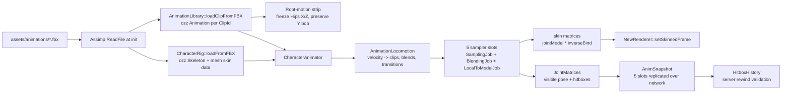

# Animations

Mixamo-style skeletal animation via ozz-animation, with FBX clips imported at runtime through Assimp. A 5-slot animator drives locomotion, overrides, and short movement transitions, then writes joint matrices for hitboxes, replication, and the renderer.

Last verified against source: 2026-05-31.

## Pipeline

## Runtime Slots

| Slot | Role |
|---|---|
| 0 | Locomotion primary: idle, walk, run, backward |
| 1 | Locomotion secondary: walk/run band blend |
| 2 | Lower-body strafe layer |
| 3 | Override: slide, wallrun, jump, debug clip |
| 4 | Transition overlay: start, stop, hard pivot |

Slot 2 is masked to the leg subtrees so strafing does not twist the torso and weapon off aim. Slot 4 is full-body and intentionally short; it smooths the first and last frames of movement without replacing the continuous locomotion loops.

## Locomotion Planner

`src/client/animation/AnimationLocomotion.*` is the pure planner. It converts local-space velocity into:

- primary and secondary locomotion clips
- strafe clip and lower-body strafe weight
- playback speed scale
- start, stop, and pivot transition intents

Reference speeds are tied to gameplay constants:

| Planner constant | Source |
|---|---|
| `k_walkSpeedRef` | `tms::k_walkStrafeSpeed` |
| `k_runSpeedRef` | `tms::k_walkForwardSpeed` |

This keeps foot cadence aligned with the movement controller instead of using stale animation-only numbers.

## Starts, Stops, And Pivots

The animator detects movement edges from raw local velocity:

- idle to moving: start transition
- moving to idle: stop transition
- hard direction reversal or left/right strafe swap: pivot transition

The preferred authored clips are:

- `StartForward`, `StartBackward`, `StartLeft`, `StartRight`
- `StopForward`, `StopBackward`, `StopLeft`, `StopRight`
- `PivotLeft`, `PivotRight`

If one of those FBXs is missing, the clip fails to load at init and the runtime uses a low-weight fallback (`SlowRun` for starts/stops, existing 90-degree turn clips for pivots). See [animation-assets-needed.md](animation-assets-needed.md).

## Crouch Clips

`CrouchWalk` now maps to `assets/animations/crouch/Walk Crouching Forward.fbx`. That file is not currently present, so the runtime falls back to the existing crouch diagonal/left clip until the straight forward crouch walk is downloaded.

`CrouchWalkBackward` remains `assets/animations/crouch/Walk Crouching Backward.fbx`.

## Update Cadence

Remote characters render from replicated `AnimSnapshot` state when available. If no server snapshot exists, their local fallback animator is still capped by the 30 Hz animation tick.

The local player's animator updates every rendered frame using the actual frame delta. That avoids the old local path where animation sampled every frame but advanced by a fixed 30 Hz timestep.

## Key Files

| File | Role |
|---|---|
| `src/client/animation/AnimationLocomotion.hpp` | Pure velocity-to-animation planner |
| `src/client/animation/AnimationLocomotion.cpp` | Clip selection, speed scale, transition detection |
| `src/client/animation/CharacterAnimator.cpp` | ozz sampling, blending, masks, procedural overlays |
| `src/client/animation/AnimationLibrary.cpp` | Clip IDs to FBX files, Assimp import, root-motion strip |
| `src/client/animation/CharacterRig.cpp` | FBX rig import and skin data |
| `src/ecs/components/AnimSnapshot.hpp` | 5-slot replicated animation state |
| `src/client/game/Game.cpp` | Local/remote animation update cadence and renderer handoff |
