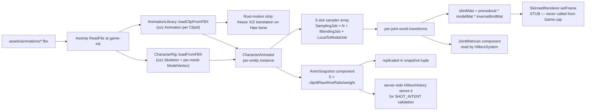
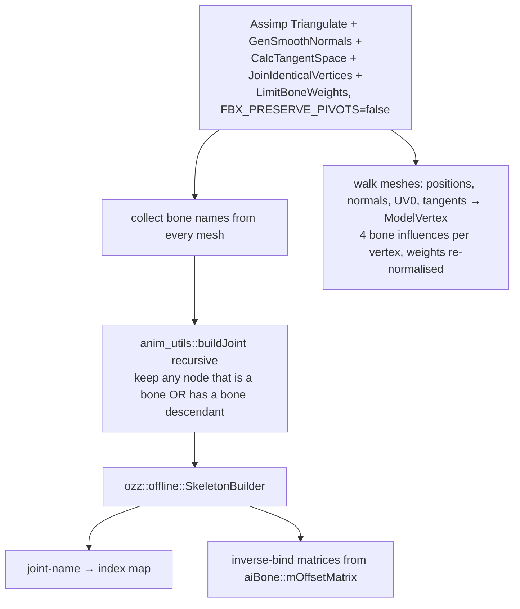
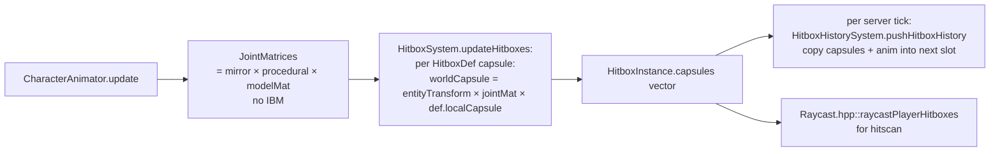
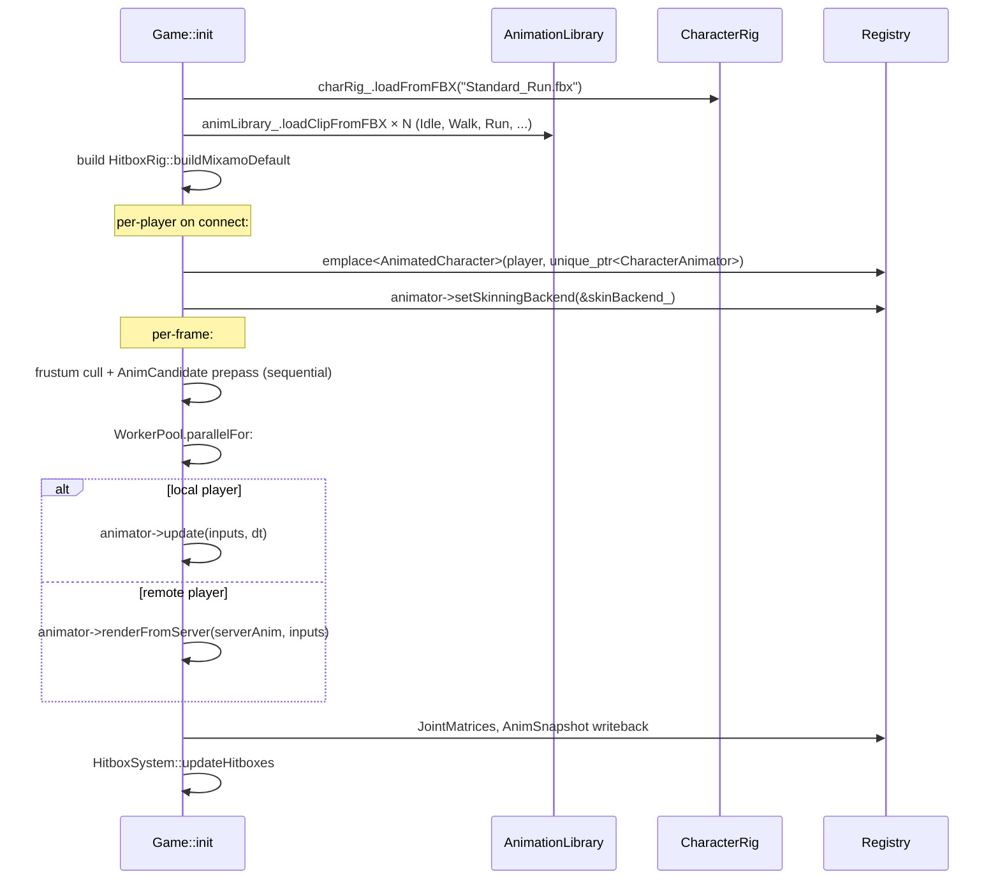

# Animations

Mixamo-style skeletal animation via **ozz-animation**, FBX imported at runtime through Assimp. A 5-slot blender drives locomotion + override clips. Animation pose is replicated to remote clients via `AnimSnapshot` so that hitboxes match across the network.

Last verified against source: branch `core/collisions+wallrun` (2026-05-16).

> The animation system **computes correctly** but its output **never reaches the GPU** — the skinned-character draw call in the new renderer is a no-op (see [graphics.md §8](graphics.md#8-skinned-characters)). Animations still feed hitbox capsules and `AnimSnapshot` replication.

---

## 1. Pipeline



---

## 2. FBX import — rig

`CharacterRig::loadFromFBX` (`src/client/animation/CharacterRig.cpp:108`):



Per-vertex layout (`SkinVertex.hpp`):

```cpp
struct ModelVertex {
  glm::vec3 position;
  glm::vec3 normal;
  glm::vec2 uv0;
  glm::vec4 tangent;          // .w = handedness sign
  glm::ivec4 boneIndices;
  glm::vec4 boneWeights;      // sum normalised to 1
};                            // sizeof = 48 + 32 = ... ~80 B
```

Fallback `tangent = (1,0,0,1)` if mesh has no tangents.

`AI_CONFIG_IMPORT_FBX_PRESERVE_PIVOTS=false` collapses FBX pivot/pre-rotation nodes so the rig tree matches the bone tree cleanly. **No axis correction** — Mixamo's Y-up convention is assumed.

---

## 3. FBX import — clips

`AnimationLibrary::loadClipFromFBX` (`AnimationLibrary.cpp:169`):

For each joint name:

- If a matching `aiNodeAnim` exists → copy keyframes (T, R, S).
- Else → emit a single rest-pose key from `rig.restPoses()`.

Then `ozz::AnimationBuilder` compiles to a runtime `Animation`.

### Root-motion strip

For every joint whose name contains `"Hips"`, X and Z translation keys are **frozen to the first frame** (Y bob preserved). Equivalent to Mixamo's "In Place" export.

Fallback: if no joint contains "Hips", strip the topmost translation-carrying joint.

### Clip catalogue (`ClipId` enum, `AnimationLibrary.hpp`)

19 named clips + `_Count` sentinel. Examples:

| ClipId | File |
|---|---|
| `Idle` | `male_locomotion_pack/idle.fbx` |
| `Walk` | `standard_walk.fbx` |
| `Run` | `running.fbx` |
| `RunBackward` | `running_backward.fbx` |
| `Slide` | `running_slide.fbx` |
| `WallRun` | `wall_run.fbx` |
| `CrouchWalk` | `crouch/Walk Crouching Backward.fbx` ⚠ |
| `CrouchWalkBackward` | `crouch/Walk Crouching Backward.fbx` ⚠ |

⚠ Both crouch clips point to the **backward** file — see *potential-issues*.

---

## 4. CharacterAnimator state machine

5 sampler slots (`CharacterAnimator.hpp:39`):

| Slot | Role |
|---|---|
| 0 | Loco primary (Idle / Walk / Run / RunBackward) |
| 1 | Loco secondary (Walk/Run band blend) |
| 2 | Loco strafe (Strafe L/R ± walk variants) |
| 3 | Override (Slide / WallRun / Jump / DebugOverride) |
| 4 | Reserved (future additive upper-body) |

Mode enum: `Locomotion`, `Crouch`, `Airborne`, `Slide`, `WallRun`, `HoldPose`, `DebugOverride`.

### Per-frame `update(inputs, dt)`

```mermaid
flowchart TD
  Filter[low-pass speed τ=0.08s<br/>directional speed τ=0.10s] --> Mode[pick target mode<br/>from moveMode/grounded/crouching]
  Mode --> Cross[modeBlendT ramps 0→1 over 0.15s]
  Cross --> Loco[pick loco clips<br/>(forward/backward × walk/run band)]
  Loco --> Strafe[pick strafe clip<br/>NOTE: swap-direction quirk]
  Strafe --> Phase[advance shared locomotionPhase<br/>by dt·speedScale/blendedDuration<br/>(no foot-popping when blending)]
  Phase --> Override[override slot if Slide/WallRun/Jump]
  Override --> Mirror[wallrun: mirror via mat[0][0]=-1]
  Mirror --> Sample[ozz SamplingJob × N]
  Sample --> Blend[ozz BlendingJob threshold 0.01]
  Blend --> L2M[ozz LocalToModelJob]
  L2M --> Head[procedural head-pitch ± 60° around head local X]
  Head --> Compose[per joint:<br/>skinMats = procedural × modelMat × inverseBind<br/>jointModelMats = mirror × procedural × modelMat]
```

### Reference speeds

| Constant | Value |
|---|---|
| `k_walkSpeedRef` | 320 |
| `k_runSpeedRef` | 530 (from `tms::k_sprintSpeed`) |
| Mode crossfade | 0.15 s |
| Override clip cycling | `overrideTime -= floor(overrideTime)` (loops forever) |
| Head pitch limit | ±60° |
| Strafe swap | hard-coded — see issue below |

### No IK

There is **no foot IK, no hand IK, no IK at all**. The "head look" is a procedural pitch rotation only. No state-machine transitions in a formal sense; no blend trees beyond the 5-slot blender; **no animation events**.

---

## 5. AnimSnapshot — replication wire

`src/ecs/components/AnimSnapshot.hpp`:

```cpp
struct AnimSlot { uint8_t clipIdRaw; float timeRatio; float weight; };
struct AnimSnapshot { AnimSlot slots[5]; };                  // 20 bytes
```

Used for:

1. **Server-side HitboxHistory** — stored alongside capsules each tick.
2. **`SHOT_INTENT` payload** — client tells server which target's anim state it saw when firing.
3. **Replicated to remote players** — server fills `AnimSnapshot` for every animator entity; client uses `CharacterAnimator::renderFromServer(serverAnim, inputs)` to overwrite local sampler state, so client and server are byte-identical for visuals + hitboxes.

The **local player** still runs its own state machine (`Game.cpp:1846-1854`); remote players are pose-replicated.

`anim_snapshot::delta(a, b)` returns a scalar drift used to accept/reject shot intents server-side (typical threshold 0.10).

---

## 6. Hitboxes from animation



12 capsules per character (Mixamo bones) defined in `HitboxRig::buildMixamoDefault`. Removed from entities with `RespawnTimer` (dead).

---

## 7. Skinning backends

### CPU LBS — `CpuLbsSkinningBackend` (`SkinningBackend.cpp`)

Linear-blend skinning on the CPU for up to 4 bones per vertex. Normals/tangents transformed by the rotation portion only, renormalised; zero-length guard.

**Installed but never invoked** (`Game.cpp:3572`: `ac.animator->setSkinningBackend(&skinBackend_);`) — no caller of `CharacterAnimator::computeSkinnedVertices`.

### GPU — `SkinnedRenderer` (`src/client/renderer-new/SkinnedRenderer.cpp`)

Designed to consume:

- A flat **palette SSBO** (per-instance `mat4` × joints)
- An **instances SSBO** (`SkinnedInstance` per entity)

`setRig`, `setFrame`, `ensureSsbos`, `uploadFrame` all implemented. `draw()` is **commented-out pseudocode** (`SkinnedRenderer.cpp:264-316`). `Game.cpp` never calls `renderer->skinned().setRig(...)` or `setFrame(...)`.

The reference shaders `shaders/pbr_skinned.vert` and `shaders/shadow_skinned.vert` exist but aren't compiled into the new renderer.

---

## 8. Game-side integration



Animation update runs at 30 Hz per remote character (decoupled via `AnimatedCharacter.animationAccumulator`) and every frame for the local player.

---

## 9. Constants

Hardcoded in `CharacterAnimator.cpp`:

| Constant | Value |
|---|---|
| `kNumSamplerSlots` | 5 |
| Mode crossfade | 0.15 s |
| Speed low-pass τ | 0.08 s |
| Directional speed τ | 0.10 s |
| Head pitch limit | ±60° |
| Reference walk speed | 320 |
| Reference run speed | 530 |
| Blend threshold | 0.01 |

---

## 10. Key files

| File | Role |
|---|---|
| `src/client/animation/CharacterRig.cpp` | FBX → ozz Skeleton + ModelVertex |
| `src/client/animation/AnimationLibrary.cpp` | FBX → ozz Animation, root-motion strip |
| `src/client/animation/CharacterAnimator.cpp` | 5-slot state machine + ozz jobs |
| `src/client/animation/SkinningBackend.cpp` | CPU LBS (installed, unused) |
| `src/client/animation/SkinVertex.hpp` | Per-vertex layout |
| `src/client/animation/FbxImportUtils.cpp` | Joint tree builder |
| `src/client/animation/AnimationTesterUI.cpp` | ImGui clip tester |
| `src/ecs/components/AnimatedCharacter.hpp` | move-only ECS holder |
| `src/ecs/components/AnimSnapshot.hpp` | 20-byte wire payload |
| `src/ecs/components/Hitbox.hpp` | Mixamo bone-capsule defs |
| `src/client/renderer-new/SkinnedRenderer.cpp` | GPU path, **draw() is a no-op stub** |
| `shaders/pbr_skinned.vert` | Reference skinning shader (not loaded today) |
| `shaders/shadow_skinned.vert` | Reference shadow skinning shader (not loaded today) |

See [graphics.md](graphics.md), [asset-loading.md](asset-loading.md), and [potential-issues.md](potential-issues.md#animations).
