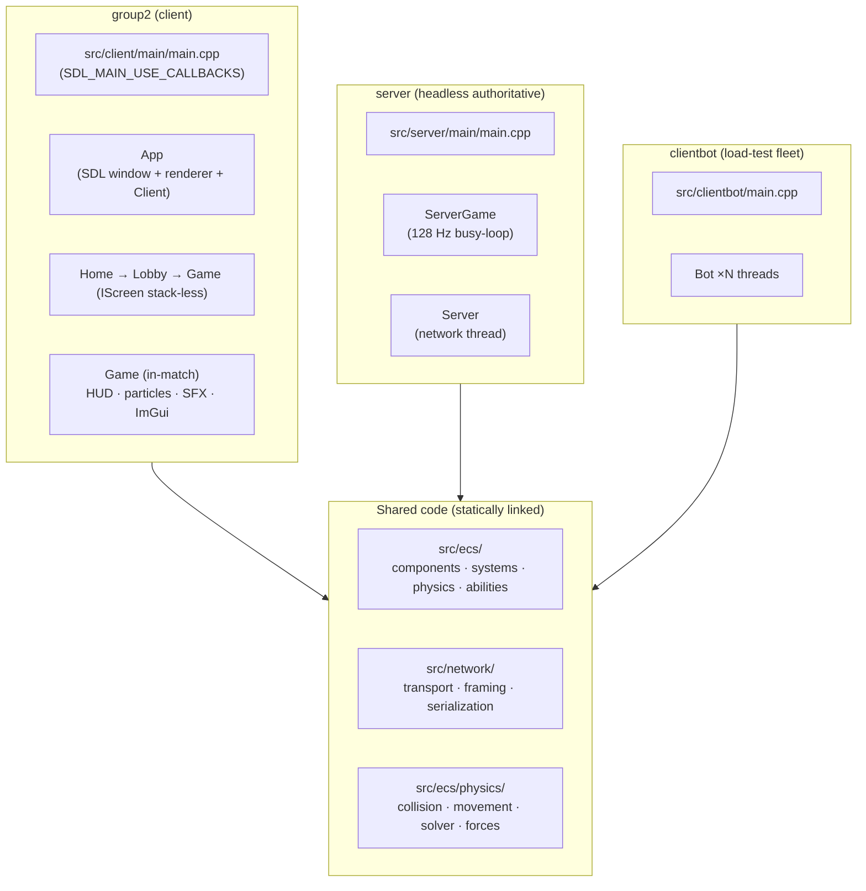
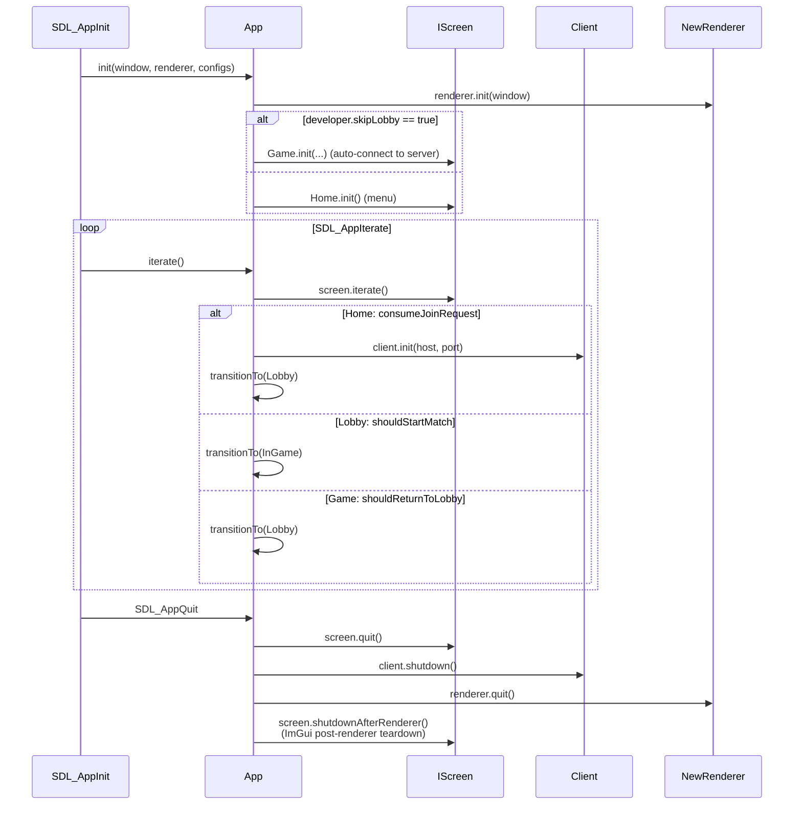
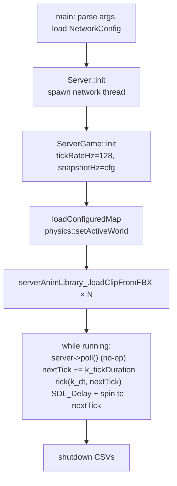
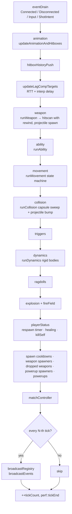
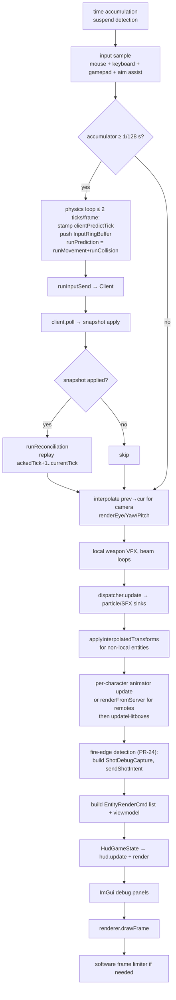
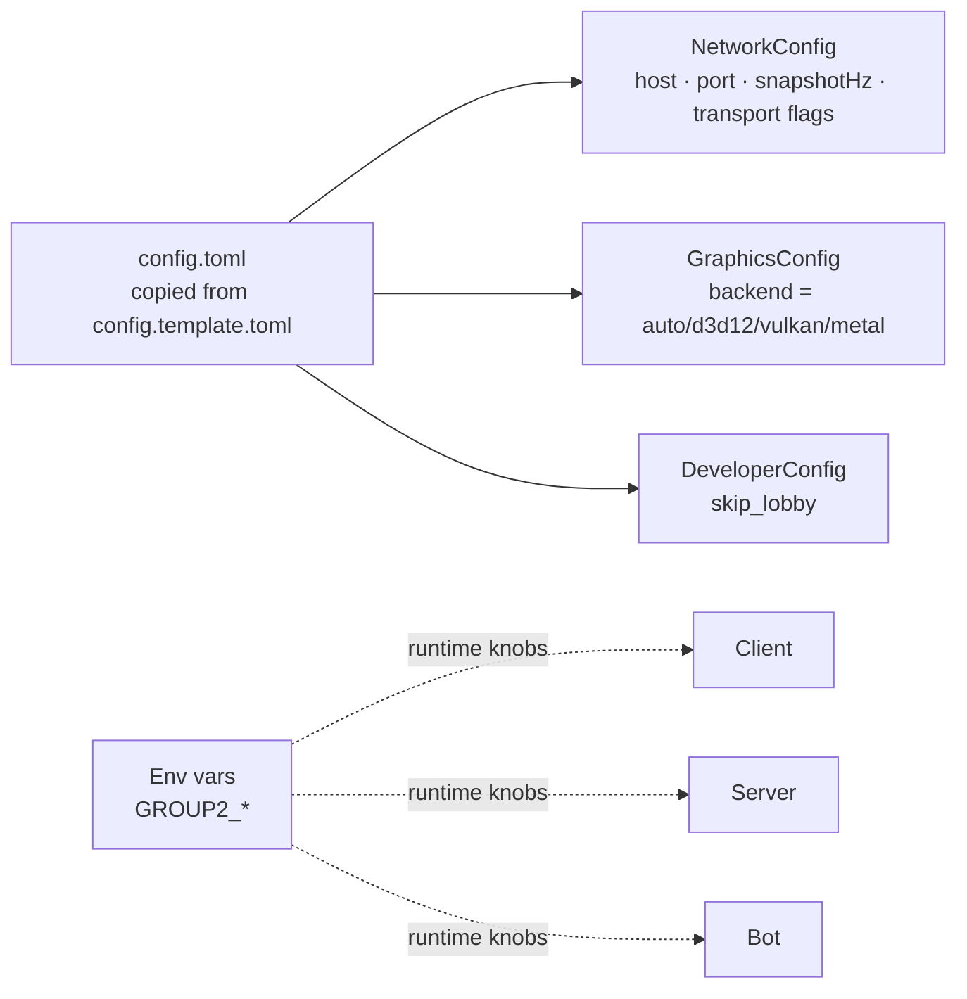

# Architecture

Top-level shape of the codebase: three binaries, one shared ECS, two threads per side, a single 128 Hz simulation everywhere.

Last verified against source: branch `core/collisions+wallrun` (2026-05-16).

---

## 1. Binaries

`CMakeLists.txt` produces three executables. The bulk of the code is in **shared libraries** linked into all three.



| Binary | Entry | Role |
|---|---|---|
| `group2` | `src/client/main/main.cpp` | Player client — windowed, GPU, audio |
| `server` | `src/server/main/main.cpp` | Authoritative simulation, no rendering |
| `clientbot` | `src/clientbot/main.cpp` | N bots in one process for load testing & prediction-parity tests |

Plus internal static libraries: `imgui_lib`, `stb_image`, `minimp3`, `vhacd` (interface wrappers around vendored deps).

---

## 2. Process lifecycle — client

`App` (`src/client/app/App.cpp`) hosts everything; one `IScreen` is active at a time.



The screen stack is **flat** — `transitionTo()` destroys the current screen and constructs the next. No back/forward history.

---

## 3. Process lifecycle — server

`ServerGame` (`src/server/game/ServerGame.cpp`) borrows a `Server&` (sockets) and runs a busy-loop:



There is also an **aggregator thread** (`group2::perf::startAggregator`, server `main.cpp:175`) emitting 1 Hz percentile timings.

---

## 4. Threading

| | Game thread | Network thread | Worker pool |
|---|---|---|---|
| **Server** | 128 Hz; owns ECS, drains EventQueue, runs all systems | ~1 kHz; owns sockets, accepts clients, reads packets, drives snapshot fanout, flushes outbound | `perf::parallelFor` via TBB across systems (`GROUP2_HAVE_TBB`) — kill switch `GROUP2_SERVER_PARALLEL=0` |
| **Client** | Per-frame (render rate); owns ECS, runs prediction + reconciliation | ~1 kHz; owns sockets, pumps TCP, drains UDP, reassembles fragments | `WorkerPool` (`src/client/util/WorkerPool.cpp`), persistent threads = `min(7, hardware_concurrency()/2)`; used for animation candidate sampling |
| **Bot** | 128 Hz per Bot instance | shared SDL_net stack | none |

**Cross-thread sync**:

| Side | Lock | Purpose |
|---|---|---|
| Server | `std::shared_mutex stateMutex_` | most paths take shared; structural changes take unique |
| Server | `EventQueue` self-mutex | network → game crossing |
| Server | atomic shared_ptr `pendingSnapshotPayload_` | game publishes snapshot, network thread picks up |
| Client | `std::mutex stateMutex_` | protects `outbound_`, `udpRecvQueue_`, latency sim |

**The ECS registry is never accessed from the network thread on either side.** Network thread fills byte queues; game thread drains them at the top of each tick.

---

## 5. Per-tick sequence — server (128 Hz)

Each tick (~7.8 ms budget):



Events received during the tick are dropped if the tick deadline is exceeded (`ServerGame.cpp:386` — see *potential-issues*).

---

## 6. Per-frame sequence — client



Spiral-of-death guard: at most `k_maxTicksPerFrame = 2` physics ticks per frame; suspend detection (`frameTime > 0.5 s`) resets the accumulator to exactly one tick.

---

## 7. Tick & data rate constants

| Constant | Value | Where |
|---|---|---|
| Server tick rate | 128 Hz | `src/server/main/main.cpp:193` (hardcoded) |
| Client physics rate | 128 Hz | `src/client/game/Game.hpp:122` (`k_physicsHz`) |
| Bot tick rate | 128 Hz | `src/clientbot/Bot.hpp:41`; override via `GROUP2_BOT_TICK_HZ` |
| Physics dt | 1/128 s | shared `k_physicsDt` |
| Default snapshot rate | 128 Hz | `NetworkConfig::serverRep.snapshotHz` |
| Max ticks/frame (client) | 2 | `k_maxTicksPerFrame` (spiral guard) |
| HitboxHistory depth | 64 ticks | `HitboxHistory::k_capacity` |
| Lag-comp max ticks | 64 | `k_maxLagCompTicks` |
| Input redundancy | 5 ticks/packet | `Client::k_inputRedundancy` |
| Reliable redundancy | 3 sends/event | `Server::k_reliableRedundancy` |

There is **no single source of truth** for tick rate — four files hardcode `128`. See *potential-issues* §A.

---

## 8. Configuration



| Env var | Effect |
|---|---|
| `GROUP2_WORKERS` | Worker thread count (client) |
| `GROUP2_CLIENT_CORES` | Linux pthread_setaffinity_np pinning |
| `GROUP2_PARALLEL_THRESHOLD` | Min items for parallelFor |
| `GROUP2_SERVER_PARALLEL=0` | Disable TBB |
| `GROUP2_SERVER_PROFILE` | Enable timing CSV |
| `GROUP2_SERVER_TRUTH_CSV` | Per-tick truth log |
| `GROUP2_CLIENT_INTERP_DELAY_SNAPSHOTS` | Override default 2 |
| `GROUP2_BOT_FLEET_RTT*` | Per-bot RTT aggregator |
| `GROUP2_BOT_LATENCY_MS` / `_LOSS_PCT` | Latency simulator |
| `GROUP2_BOT_OBS_CSV_PREFIX` / `_SHOTS_CSV_PREFIX` | Bot CSV logs |
| `GROUP2_BOT_CPUS=lo,hi` | Bot CPU pinning |
| `GROUP2_BOT_AI=1` | Bot stochastic agent |
| `GROUP2_BOT_AIM=1` | Bot aims at remote players |
| `BENCH_SECONDS` / `BENCH_RENDER_SCALE` | Client benchmark mode |
| `GROUP2_NO_IMGUI` | Suppress ImGui (perf) |

---

## 9. File layout

```
src/
├── client/
│   ├── animation/       — CharacterAnimator, ozz wrapper
│   ├── app/             — App (window, renderer, configs)
│   ├── debug/           — DebugUI (ImGui), FrameRecorder
│   ├── game/            — Game (in-match IScreen, ~3500 lines)
│   ├── hud/             — 4-layer immediate-mode HUD
│   ├── main/            — entry main.cpp
│   ├── menus/           — Home, Lobby screens
│   ├── network/         — Client, EntityInterpolation
│   ├── particles/       — CPU sim + GPU render
│   ├── renderer-new/    — SDL_GPU renderer (mid-migration)
│   ├── sfx/             — SDL3 audio
│   ├── systems/         — Prediction, Reconciliation, input sampling
│   └── util/            — WorkerPool
├── clientbot/           — Bot + main
├── ecs/
│   ├── abilities/       — Dash, Grapple
│   ├── components/      — ~47 components
│   ├── physics/         — Collision, dynamics, solver, joints
│   ├── registry/        — Registry.hpp = using entt::registry
│   ├── systems/         — Shared systems (Movement, Collision, Weapon, ...)
│   ├── AssetCatalog.hpp — Compile-time AssetDefinitions
│   ├── AssetRegistry.hpp — Runtime name → modelIndex
│   └── MapConfig.hpp    — loadConfiguredMap entry point
├── network/
│   ├── transport/       — UDP endpoint, fragment reassembler, packet header
│   ├── lobby/
│   ├── MessageStream.*  — TCP length-prefixed framing
│   ├── OutboundQueue.*  — Per-client send queue
│   ├── PacketType.hpp
│   ├── NetworkConfig.*
│   ├── RegistryArchive.hpp
│   └── RegistrySerialization.*  — Synced tuple + RLE delta
└── server/
    ├── game/            — ServerGame
    ├── lobby/           — LobbyManager
    ├── main/            — entry
    ├── network/         — Server (sockets)
    ├── perf/            — Profiler, Parallel.hpp (TBB)
    └── systems/         — Server-only (HitboxHistory, MatchController, ...)
```

---

## 10. Subsystem links

| Topic | Doc |
|---|---|
| ECS | [ecs.md](ecs.md) |
| Physics & movement | [physics.md](physics.md) |
| Collisions | [collisions.md](collisions.md) |
| Networking | [networking.md](networking.md) |
| Rendering | [graphics.md](graphics.md) |
| Asset loading | [asset-loading.md](asset-loading.md) |
| Animations | [animations.md](animations.md) |
| Particles & VFX | [particles-vfx.md](particles-vfx.md) |
| HUD | [hud.md](hud.md) |
| SFX | [sfx.md](sfx.md) |
| Gameplay (weapons/abilities/match) | [gameplay.md](gameplay.md) |
| Known issues found while writing these | [potential-issues.md](potential-issues.md) |
