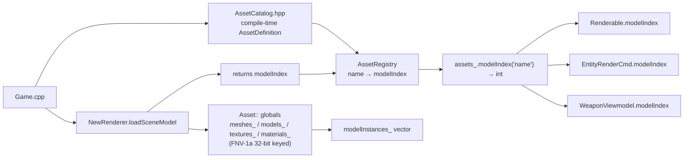
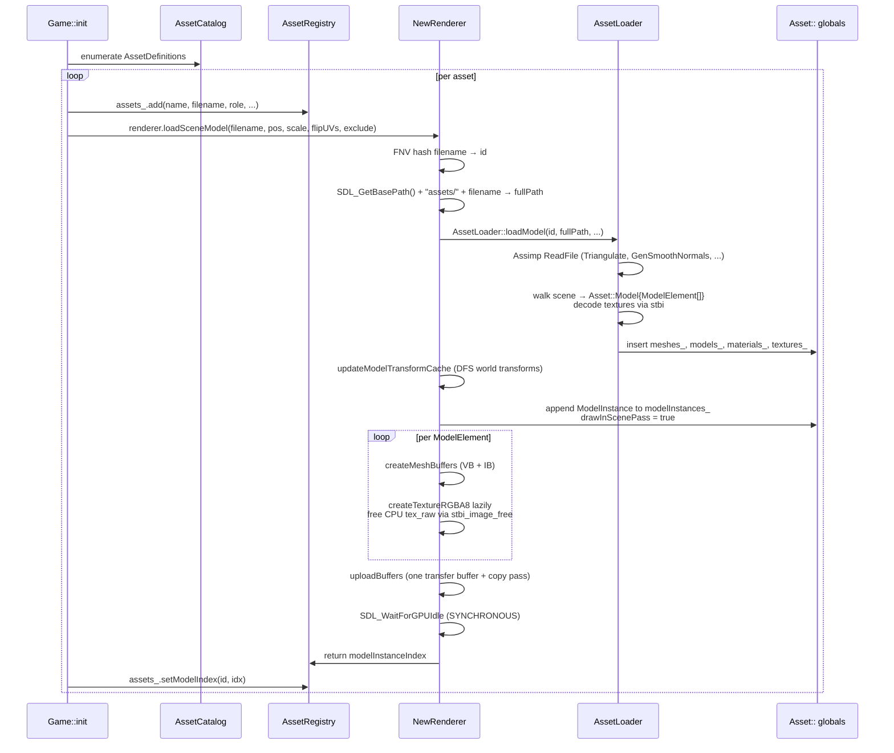

# Asset loading

GLB / FBX assets loaded synchronously at game-init via Assimp. Two parallel registries: a renderer-side global hash map and a game-side name directory. Maps are loaded by a single shared entry point so client/server prediction agrees.

Last verified against source: branch `core/collisions+wallrun` (2026-05-16).

---

## 1. Asset directory layout

```text
assets/
├── 404.jpeg                                 — default fallback texture
├── config/assets.json                       — per-asset transform sidecar (DEAD CODE, never parsed)
├── maps/map1.glb                            — current map (collision + visuals)
├── apex_legends_*.glb                       — weapon models (rifle, wingman, triple-take)
├── r-301_-_apex_legends.glb                 — rifle
├── rocket_launcher.glb, rail_gun.glb, ...   — weapon models
├── Apex_Legend_Wraith.glb (×2 dup, 22 MB)   — player character (unreferenced)
├── free_1975_porsche_911_930_turbo.glb      — 74 MB prop, load COMMENTED OUT (75-mesh hierarchy)
├── animations/
│   ├── idle.fbx, fast_run.fbx, ...          — root-level Mixamo clips
│   ├── male_locomotion_pack/                — subfolder of locomotion clips
│   └── crouch/                              — crouch-walk clips
├── sounds/*.{wav,mp3}                       — SFX (~20 clips, mostly memes)
└── uploads_files_812442_HdriFree/*.hdr      — 15 HDRIs (skybox path STUB)
```

All assets are tracked with Git LFS via `.gitattributes`. Files in `assets/` are automatically stored in LFS regardless of extension.

---

## 2. Two-registry design



### `Asset` namespace globals (`src/client/renderer-new/Asset.hpp`)

`inline std::unordered_map`s at file scope (header-only):

```cpp
inline std::unordered_map<ModelIdInt, Mesh> meshes_;
inline std::unordered_map<ModelIdInt, Model> models_;
inline std::unordered_map<ModelIdInt, Texture> textures_;
inline std::unordered_map<ModelIdInt, Material> materials_;
inline std::vector<ModelInstance> modelInstances_;
```

`ModelIdInt = uint32_t`, derived via `Asset::fnv1a32(filename)`. Hash collisions silently overwrite — `unordered_map::operator[]` is used.

### `AssetRegistry` (`src/ecs/AssetRegistry.hpp`)

```cpp
struct AssetEntry {
  std::string name;
  std::string filename;
  AssetRole role;            // Map, Weapon, Prop, Projectile, Effect, ...
  glm::vec3 renderScale, renderTranslation;
  glm::vec3 renderRotationEuler;
  int modelIndex = -1;       // index into Asset::modelInstances_
  bool hasCollision = false;
};
```

API: `add(name, filename, role, …)`, `setModelIndex(id, idx)`, `setHasCollision(id)`, `modelIndex(name|id)`, `id(name)`, `entry(id)`, `entries()`, `count()`.

### `AssetCatalog.hpp` — compile-time definitions

| Definition | Purpose |
|---|---|
| `kMapAsset` | `maps/map1.glb` + `loadScale = 39.3701` (m→inches) |
| `kPropAssets[]` | static placed props (currently empty) |
| `kRocketProjectile` | rocket projectile model |
| `kWeaponAssets[]` | rifle / rocket / railgun / energygun |
| `kEffectAssets[]` | procedural effect names (no filename) |

---

## 3. Asset loading flow



`modelInstances_` is global. The returned index from `loadSceneModel` is the index into that vector — not the FNV hash. `Renderable.modelIndex`, `EntityRenderCmd.modelIndex`, `WeaponViewmodel.modelIndex` all use this `modelInstanceIndex`.

---

## 4. Map loading

```mermaid
flowchart TD
  Call["gamemap::loadConfiguredMap(out, tag)"] --> Phys["physics::loadMapCollision<br/>(extract authored collision trimeshes)"]
  Phys --> Mesh["COL_* production nodes<br/>preserved as WorldTriMesh"]
  Phys --> Legacy["prototype/prop compatibility:<br/>primitive fitting<br/>prop V-HACD only if enabled"]
  Mesh --> Cook[buildTriMeshBVH + weldTriMesh]
  Legacy --> Cook
  Call --> ReImport[Re-import GLB without flags]
  ReImport --> Meta[Walk aiNode metadata for entity_type:<br/>0 = spawn point<br/>1 = weapon spawner<br/>2 = powerup spawner]
  Meta --> Globals["gamemap::spawnPoints_ etc.<br/>mutable inline globals"]
  Meta --> Side["spawn_points.txt CSV written to CWD"]
  Cook --> SetWorld[physics::setActiveWorld<br/>(WorldGeometry singleton)]
```

`gamemap::loadConfiguredMap` (`src/ecs/MapConfig.hpp:182`) is the **single shared entry point** both client and server call — same map-load code path keeps prediction in sync.

### MapConfig flags

```cpp
inline constexpr bool k_separatedCollisionMap = true;    // collision nodes prefixed COL_ in GLB
inline constexpr const char* k_collisionPattern = "COL_";
inline constexpr bool k_useVhacd = false;                // props only; also requires GROUP2_ENABLE_VHACD=ON
```

### Spawn/powerup/weapon spawner globals

```cpp
inline std::vector<glm::vec3> spawnPoints_;
inline std::vector<WeaponSpawner> weaponSpawner_;
inline std::vector<PowerupSpawner> powerupSpawner_;
```

These are **mutable inline globals** in `MapConfig.hpp` — populated as a side effect of `loadConfiguredMap`, not cleared between calls. `clientbot` calls `loadConfiguredMap` per-bot in the same process — the lists append. See [potential-issues.md](potential-issues.md#asset-loading).

`gamemap::WeaponSpawner` (in MapConfig.hpp) is a separate struct from the ECS `WeaponSpawner` component, sharing the name — confusing.

---

## 5. JSON sidecar (dead code)

`assets/config/assets.json` is structurally a per-asset transform sidecar:

```json
{
  "maps/map1.glb": { "scale": [...], "rotation": [...], "translation": [...] }
}
```

…but only `maps/map1.glb` has an entry today and **nothing in `src/` parses the file**. Production overrides come from `AssetCatalog.hpp` compile-time constants.

---

## 6. Asset paths

| Source | How resolved |
|---|---|
| All paths | Relative to `SDL_GetBasePath()` (binary's directory after CMake POST_BUILD copy) |
| Asset dir base | Hardcoded `#define ASSETS_DIR "assets"` (`Asset.hpp:12`) |
| Default texture | Hardcoded `"assets/404.jpeg"` (`NewRenderer.cpp:101`) |
| Animations | `assets/animations/...` |
| Sounds | `assets/sounds/...` |

**No hot reload.** Asset changes require restart.

---

## 7. Hash collision risk

`Asset::fnv1a32` is 32-bit. Two assets with colliding hashes overwrite each other in `Asset::meshes_/models_/textures_/materials_` silently (no log message). With ~30 assets the collision probability is vanishingly small (~1 in 10^8) but worth noting.

---

## 8. Shutdown leak

`NewRenderer::quit` walks `Asset::meshes_` to release VBs/IBs, but **never iterates `Asset::textures_`** — every `SDL_GPUTexture*` allocated in `loadSceneModel` leaks at shutdown. Globally-shared static maps are also never explicitly cleared. Single-renderer-per-process saves us in practice, but every exit leaks textures.

---

## 9. Animation loading

FBX files are loaded by `AnimationLibrary::loadClipFromFBX` / `CharacterRig::loadFromFBX` — both are **runtime Assimp imports on the main thread** at game-init (`Game.cpp:512-561`). See [animations.md](animations.md).

The map of clip to filename is hardcoded in `AnimationLibrary.cpp` (`clipFile()`). Convention is intentionally mixed because some assets live in `male_locomotion_pack/`, some live at the root, and newer movement-polish clips are expected under `loco/`. See [animation-assets-needed.md](animation-assets-needed.md) for the missing start/stop/pivot clips and straight crouch-forward clip.

---

## 10. Sound loading

Sound clips are loaded by `SfxSystem::loadClip` from `assets/sounds/` at init. WAV via `SDL_LoadWAV`, MP3 via `minimp3` (single-TU vendored). After load, `preconvertClips` converts every clip to the device's native format using `SDL_ConvertAudioSamples` — CPU-saving so the audio callback doesn't resample per-callback (especially on macOS). See [sfx.md](sfx.md).

---

## 11. Key files

| File | Role |
|---|---|
| `src/client/renderer-new/Asset.hpp` | Global asset maps + types |
| `src/client/renderer-new/AssetLoader.cpp` | Assimp wrapper |
| `src/client/renderer-new/NewRenderer.cpp:475-545` | `loadSceneModel` |
| `src/ecs/AssetCatalog.hpp` | Compile-time `AssetDefinition`s |
| `src/ecs/AssetRegistry.hpp` | Runtime name→modelIndex registry |
| `src/ecs/MapConfig.hpp` | `loadConfiguredMap` (single entry, both sides) |
| `src/ecs/physics/MapLoader.cpp` | Authored collision trimesh extraction + legacy primitive opt-ins |
| `src/client/animation/CharacterRig.cpp` | Skeletal rig from FBX |
| `src/client/animation/AnimationLibrary.cpp` | Animation clip loading |
| `src/client/sfx/SfxSystem.cpp` | Sound clip loading (WAV + MP3) |
| `assets/config/assets.json` | Dead JSON sidecar — not parsed |
