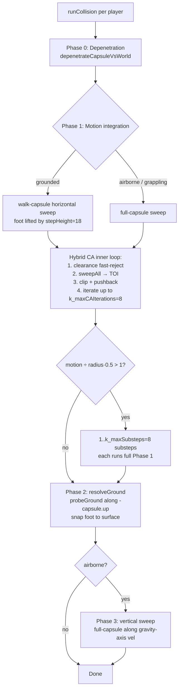
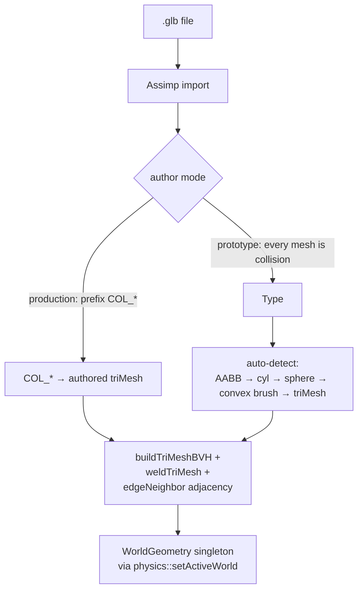
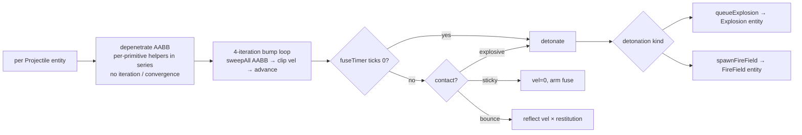

# Collisions

Per-player **capsule** with hybrid conservative-advancement (CA), per-pass-deepest depenetration, two-capsule stair handling, and a welded-edge-classified BVH triangle mesh. Projectiles still use the legacy AABB path. This is the area with **known active regressions** on branch `core/collisions+wallrun`.

Last verified against source: branch `core/collisions+wallrun` (2026-05-16).

---

## 1. Pipeline overview



Players use Phase 0–3. Projectiles use a separate legacy AABB bump loop (see §7).

---

## 2. Player capsule

```mermaid
flowchart LR
  subgraph Full["Full capsule (standing)"]
    F1[radius = 16]
    F2[halfHeight = 20<br/>total = 2·(20+16) = 72]
  end
  subgraph Walk["walkCapsule (grounded horizontal sweep)"]
    W1[radius = 16]
    W2[halfHeight = 20 - 9 = 11<br/>foot lifted by 18u = stepHeight]
  end
```

- `halfExtents = {16, 36, 16}` is the conservative AABB enclosure (used for BVH culling, projectile-style queries, broadphase fallback).
- `up = ±Y` depending on `gravityFlipped`.
- Crouch: `resizePlayerCapsule(crouching=true)` shrinks `halfHeight` from 20 → 6 (and `halfExtents.y` from 36 → 22); translates `pos` to keep the foot in place. Auto-uncrouch validates via `playerFitsAt` → `clearanceCapsuleVsWorld`.
- **Bone-capsule hitboxes** (`Hitbox.hpp`) are completely separate — 12 per character driven by `JointMatrices`, used only by hitscan in `Raycast.hpp`. They never collide with the world.

---

## 3. Static map representation

Built once at load by `MapLoader` (`src/ecs/physics/MapLoader.cpp`):



`WorldGeometry` (`WorldData.hpp`) holds `std::span` views into a backing `MapCollisionData` (planes / boxes / brushes / cylinders / spheres / triMeshes). **The backing storage must outlive every access** — owned by `Game`/`ServerGame` as a member.

`testWorld()` is a hardcoded dev arena (floor plane + 30 AABB boxes including a 5-step staircase + 3 brushes), loaded by default if `setActiveWorld` isn't called.

### Cooked mesh format

Header magic `'g2cm'`, version `2` (v2 adds `edgeNeighbor`). Layout:

```text
[Header 32B] [vertices] [indices] [faceNormals] [edgeActive]
[vertActive] [edgeNeighbor] [u32 matCount] [triangleMaterials]
[BVHNode array] [triIndices]
```

Raw byte runs, **no endianness guard** — x86 little-endian only.

### BVH

- Midpoint-split centroid partition on longest axis (comment says "SAH-like" but it's just midpoint).
- `k_maxLeafTris = 4`.
- Flat-array binary tree. Stack-recursive subdivide.
- 64-slot iteration stack — bounds a depth of 64 (`4·2^63` triangles in a balanced tree).

### Edge welding

`weldTriMesh` (`TriMeshCollision.cpp:822-945`) classifies each shared edge by dihedral angle:

- `cosTheta < cos(2°)` → edge is **active** (real corner); contacts on this edge can fire
- Else (nearly coplanar) → edge **inactive**; back-side contacts on the inactive feature are rejected to silence internal-edge jitter
- `edgeActive` bitset + `vertActive` bitset
- `edgeNeighbor[3 * tri + edge]` — Phase B adjacency for manifold walking; populated as a side product
- Non-manifold edges (>2 incident faces) treated as active boundary

---

## 4. Sweep / depen primitives (`SweptCollision`, `TriMeshCollision`)

All swept queries return `HitResult { hit, tFirst, normal, surfaceType }`. Closest-point queries return `ClearanceResult { contact, distance, point, normal, surfaceType }`. Per-pass-deepest queries return `DepenContact { valid, depth, normal }`.

### What's implemented per primitive

| Primitive | AABB sweep | AABB depen | Capsule sweep | Capsule depen | Capsule clearance |
|---|---|---|---|---|---|
| Plane | exact | exact | exact (Minkowski extent) | exact | exact |
| Box | slab-on-Minkowski-expanded | least-pen MTV | **conservative** (uses enclosingHalfExtents `(r, h+r, r)`) | **conservative** | **conservative** |
| Brush | half-space intersect | MTV per plane | **conservative** | **conservative** | **conservative — buggy** |
| Cylinder | Y-slab + 2D ray-vs-circle | ✓ | conservative | conservative | conservative |
| Sphere | conservative corner | ✓ | conservative | conservative | conservative |
| TriMesh | per-tri (Möller-Trumbore-ish with reach test) | Voronoi-feature MTV (Ericson §5.1.5) | per-tri capsule sweep | per-tri Voronoi capsule MTV | BVH-accel `closestPointSegmentTriangle` |

The Box/Brush/Cylinder/Sphere capsule paths use an AABB-enclosing approximation — the comment says "real maps are trimesh" but the dev arena's staircase is built from boxes, which is where the **stair-climb regression** lives.

### Triangle-mesh details

- **`aabbVsTriVoronoi`** / **`capsuleVsTriVoronoi`**: plane test (`|s| > r`? skip) → closest Voronoi feature (face / edge / vertex) → bounded-reach check → velocity-coherent culling (`dot(vel, faceN) > 0` → reject) → **welded-feature rejection** (back-side `s < 0` with inactive flags → reject). Returns face-normal MTV at depth `r - s`.
- **`sweepCapsuleVsTriangle`** / **`sweepAABBvsTriangle`**: ray vs expanded-plane test + reach check. Active-edge flags **intentionally not consulted** on the sweep path (both coplanar triangles report identical hits; bump-loop's clip resolves).
- **`closestPointOnMesh`**: BVH-accelerated, shrinks search radius as closer triangles are found.
- **`depenetrateAABBvsTriMesh`** (legacy): up to 4 passes, MTV summing with per-tick rate-limited recovery (cap `0.5·R_dir`). **Now only called from the projectile path.**

---

## 5. Phase 0 — Depenetration (`depenetrateCapsuleVsWorld`)

```mermaid
flowchart TD
  Start[input pos, vel, capsule] --> Loop{pass < k_maxDepenPasses=6}
  Loop --> Deepest[deepestCapsuleContact<br/>scene-wide max over per-primitive<br/>deepestVs* helpers]
  Deepest --> Has{valid contact?}
  Has -- no --> Done[return success]
  Has -- yes --> Osc{opposing normal vs lastNormal?<br/>dot < -k_floorAngleCos}
  Osc -- yes --> Unstick[emergencyUnstick fallback]
  Osc -- no --> Push[pos += normal * (depth + k_contactEpsilon)<br/>vel -= normal * max(0, dot(vel,normal))]
  Push --> Loop
  Unstick --> Done
```

**`emergencyUnstick`** probes outward at 6 cardinal directions (+Y first — most common "spawn in floor" case, then −Y, ±X, ±Z) at exponentially growing radii (r, 2r, 4r, …) up to `k_emergencyUnstickRadius = 64`. Picks best-clearance candidate. **Zeros velocity** on success.

**Limitations** (see *potential-issues*):

- Oscillation detector uses `k_floorAngleCos` (0.7) as the opposing-normal threshold — 120° "V" wedges may not trip it.
- When no contact is found at all (e.g. two-sided welded coplanar pair rejecting both faces), `emergencyUnstick` is **not invoked** because the gate is `if (contact.valid)`. This is the **stuck-in-thin-planes** failure mode.

---

## 6. Phase 1 — Hybrid CA inner loop

```mermaid
flowchart TD
  Start[remaining motion = vel * dt] --> Sub[1..k_maxSubsteps=8 substeps]
  Sub --> Iter{iter < k_maxCAIterations=8}
  Iter --> Cl[clearanceCapsuleVsWorld]
  Cl --> Fast{distance > motionBound + k_pushback?}
  Fast -- yes --> Advance[advance whole step, break]
  Fast -- no --> Sweep[sweepAll → TOI]
  Sweep --> Hit{hit?}
  Hit -- no --> AdvAll[advance whole step, break]
  Hit -- yes --> Tick[advance to TOI<br/>clip vel<br/>push back by k_pushback]
  Tick --> Floor{dot(normal, up) ≥ k_floorAngleCos}
  Floor -- yes --> Ground[mark grounded, store groundNormal]
  Floor -- no --> Wall[clip horizontal vel]
  Ground --> Iter
  Wall --> Iter
```

**Sub-stepping** triggers when `|v|·dt > radius·0.5 = 8u/tick`. At grapple speeds (4000 u/s) up to 5 substeps; normal walking (≤800 u/s) → 1 substep.

**`k_maxCAIterations = 8`** is a magic literal in `CollisionSystem.cpp:533` — should live in `PhysicsConstants.hpp` next to the other CA constants. Same for `jumping` threshold `> 10.0f u/s` at `:631`.

---

## 7. Projectile path (legacy)

Separate code path in `runCollision`:



**No capsule projectile path** — every projectile uses `shape.halfExtents` (AABB depen + sweep) regardless of `CollisionShape.type`. No live capsule projectile today, but it's a footgun.

---

## 8. Wall Detection And Attachment

`WallDetection::detectWalls` (`src/ecs/physics/WallDetection.cpp`) uses triangle-mesh surface queries first and keeps
sphere-cast fallback for prototype/primitive worlds:

| Probe | Distance | Filter |
|---|---|---|
| Right/left wall | segment closest-point against static triMeshes, fallback sphere-cast | `isWallNormal` |
| Forward wall | segment closest-point against static triMeshes, fallback sphere-cast | `isWallNormal` |
| Wallrun sustain | `findWallRunAttachment` closest-point + lookahead + triangle adjacency | preserves mesh/triangle/feature identity |
| Ledge | sphere-cast from head-top forward, then downward | requires `normal.y > 0.7` |
| Ground distance | sphere-cast radius 2, 500u down | reports `groundDistance` for wallrun/climb min-height gates |

Wallrun attachment stores `meshIndex`, `triId`, and `TriRegion`, and `findWallRunAttachment` can walk across welded
triangle adjacency. This is what allows continuity across inside and outside 90-degree mesh seams.

Known limitation: ledge detection and `groundDistance` still use sphere-casts rather than the full capsule KCC ground
probe. They now follow flipped gravity direction, but they remain less authoritative than the KCC path.

`findWallAttachment` is intentionally triMesh-first. Boxes/brushes/cylinders/spheres are kept as fallback/prototype
geometry, not the production map surface-tracking path.

---

## 9. Broadphase

`StaticWorldBroadphase` (`SweptCollision.cpp`) is the live immutable broadphase over static `WorldTriMesh` bounds. It is
built after map/prop loading and queried by KCC sweeps, depenetration, ground probes, wall probes, sphere-casts, and
world raycasts before entering each mesh's per-triangle BVH.

Map loading now emits aggregate trimesh validation totals alongside cook stats: mesh/triangle count, invalid mesh count,
degenerate triangles, opposite-winding duplicate faces, non-manifold edges, invalid indices, BVH quality, seam weld
counts, and invalid cooked normals.

`BroadphaseTree` (`src/ecs/physics/BroadphaseTree.cpp`) is a separate Box2D-style fat-AABB BVH for future dynamic rigid
bodies. It still has no live player/projectile consumers.

`SimdAabb::aabbBatchOverlap` is a 4-wide SSE2 batch test — no live call sites.

---

## 10. Contact cache & solver

For rigid bodies only (not players). `ContactCache::merge` looks up per-pair manifolds, copies cached `normalImpulse` + `tangentImpulse[2]` by `featureId.value` for warm-start. `endFrame()` reaps untouched entries.

The PGS solver (`Solver.cpp`) is detailed in [physics.md §7](physics.md#7-dynamics-rigid-bodies).

---

## 11. Constants summary

| Constant | Value | Where |
|---|---|---|
| `k_contactEpsilon` | 0.03125f (1/32) | `SweptCollision.cpp:21` (file-local) — Quake `DIST_EPSILON` |
| `k_pushback` | 0.03125f | `CollisionSystem.cpp:74` (file-static) |
| `k_floorAngleCos` | 0.7f | `PhysicsConstants.hpp` |
| `k_maxDepenPasses` | 6 | `PhysicsConstants.hpp` |
| `k_emergencyUnstickRadius` | 64u | `PhysicsConstants.hpp` |
| `k_groundSnapDistance` | 8u | `PhysicsConstants.hpp` |
| `k_stepHeight` | 18u | `PhysicsConstants.hpp` |
| `k_substepSafetyRatio` | 0.5f | `PhysicsConstants.hpp` |
| `k_maxSubsteps` | 8 | `PhysicsConstants.hpp` |
| `k_enableSubstepping` | `true` | `PhysicsConstants.hpp` |
| `k_maxCAIterations` | 8 | magic in `CollisionSystem.cpp:533` |
| `k_maxLeafTris` | 4 | `TriMeshCollision.cpp` |
| `k_maxPasses` (legacy MTV depen) | 4 | `TriMeshCollision.cpp` |
| `k_capRatioOfR` (legacy depen per-tick budget) | 0.5 | `TriMeshCollision.cpp` |

---

## 12. Phase A/B/C-deep status

| Feature | Status |
|---|---|
| Phase A: capsule sweep vs all primitives | **Live** but box/cyl/sphere paths are *conservative* (enclosingHalfExtents) |
| Phase A: capsule depen vs all primitives | **Live**; legacy AABB depen kept for projectiles |
| Phase B: edge-neighbor adjacency | **Live as data** (`edgeNeighbor` populated), **not consumed** |
| Phase B: closest-point-on-mesh | **Live**; used by wallrun's `findWallAttachment` |
| Phase B: active-edge swap on sweep | **Intentional no-op** — `(void)edgeFlags; (void)vertFlags;` |
| Phase C: per-primitive capsule clearance | **Live**; `clearanceCapsuleVsBrush` reports MAX of positive clearances (overestimates — see *potential-issues*) |
| Phase C: hybrid CA inner loop | **Live** |
| Phase C: sub-stepping | **Live** |
| Phase C-deep: two-capsule stair step | **Live** but **regressing** on box stairs |
| Phase C-deep: per-pass-deepest depen | **Live** |
| Phase C-deep: emergency unstick | **Live** but gated by `if (contact.valid)` — see issue |
| Phase D: wall manifold walk | **Live** — attachment stores mesh/triangle/feature and walks neighbouring triangles across seams |
| Phase E: edge-traversal polish | **Live for static triMeshes** |
| Phase F: Lucio entry impulse | **Live** |

---

## 13. Recently Fixed Collision Regressions

The following user-reported regressions on `core/collisions+wallrun` now have direct regression coverage in
`tests/physics_trimesh_tests.cpp`:

- Smooth ascent over authored thin trimesh stairs at walk and sprint speed.
- Thin wall and ceiling planes blocking from both sides / high-speed casts.
- Degenerate ground-probe triangles ignored without NaN state.
- Sloped ceiling underside no longer used as a deep negative ground snap target.
- Wallrun continuation across same-mesh and mesh-to-mesh 90-degree corners.
- Climb/ledge handoff invalid normals guarded from poisoning position or velocity.

Open collision work should be tracked against fresh repros; older hypotheses in
[potential-issues.md](potential-issues.md#collisions) may predate these fixes.

---

## 14. Key files

| File | Role |
|---|---|
| `src/ecs/systems/CollisionSystem.cpp` | Per-tick driver, player kernel, projectile kernel |
| `src/ecs/physics/SweptCollision.cpp` | Sweep + depen + clearance primitives |
| `src/ecs/physics/TriMeshCollision.cpp` | BVH + welding + per-tri Voronoi MTV + closest-point |
| `src/ecs/physics/MapLoader.cpp` | Assimp + authored map triMesh extraction + prototype/prop primitive fitting + cook |
| `src/ecs/physics/CookedMeshFormat.cpp` | On-disk format `'g2cm'` v2 |
| `src/ecs/physics/BroadphaseTree.cpp` | Dynamic AABB tree (no live consumer in player path) |
| `src/ecs/physics/ContactCache.cpp` | Warm-start cache |
| `src/ecs/physics/Raycast.hpp` | Hitscan ray queries |
| `src/ecs/physics/WallDetection.cpp` | Trimesh closest-point wallrun/climb/ledge probes |
| `src/ecs/physics/WorldData.hpp` | Global `WorldGeometry` singleton |
| `src/ecs/physics/PhysicsConstants.hpp` | Tunables |
| `src/ecs/components/CollisionShape.hpp` | `CollisionShapeType` + capsule params |
| `src/ecs/components/Hitbox.hpp` | Bone-capsule hitboxes (separate from environmental collision) |

See [physics.md](physics.md) for the movement-side counterpart and [potential-issues.md](potential-issues.md) for the full bug list.
