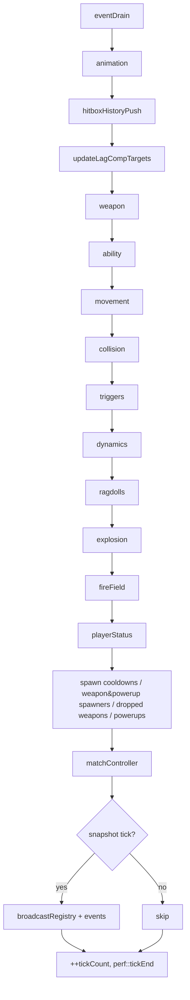

# ECS

EnTT v3.14 used directly (no abstraction). Plain components, free-function systems, shared code compiled into both client and server. The same ~47 components and ~25 systems back local prediction and authoritative simulation.

Last verified against source: branch `core/collisions+wallrun` (2026-05-16).

---

## 1. The registry

`src/ecs/registry/Registry.hpp` — one line:

```cpp
using Registry = entt::registry;
```

There is **no stub**; the README description claiming a roll-your-own minimal Registry is out of date. EnTT is fetched in `CMakeLists.txt:267-271`.

Entity IDs are `entt::entity`. Server and client maintain independent ID spaces — the client's `Loader::map(serverEntity)` translates incoming snapshot IDs to local handles.

---

## 2. Components

47 components, grouped below. Files in `src/ecs/components/`.

### Player core / identity

| Component | Purpose |
|---|---|
| `Player` | Empty tag |
| `LocalPlayer` | Empty tag — exactly one entity per client |
| `Controllable` | Client-side tag — entity may receive local input. Removed on death |
| `ClientId` | `{int value=-1}` + std::hash specialisation |
| `PlayerName` | Fixed-size 24-byte buffer, `isCustom` flag — trivially copyable |
| `PlayerColor` | `{glm::vec3 rgb, int paletteIdx}` — server assigns from `player_colors::k_palette` |
| `DeathInfo` | Killer's ClientId + Health snapshot at moment of death |

### Movement / locomotion state

| Component | Purpose |
|---|---|
| `Position` | `glm::vec3` Quake units, Y-up |
| `Velocity` | `glm::vec3` u/s |
| `PreviousPosition` | Render interp source — client-only |
| `Orientation` | `glm::quat` (for dynamic rigid bodies) |
| `AngularVelocity` | body-space ω rad/s |
| `CollisionShape` | `{type=AABB\|Capsule, halfExtents, radius, halfHeight}` |
| `PlayerVisState` | **Replicated** locomotion (moveMode, wallRunSide, jumpCount, grounded, crouching, isDead, grappleActive, gravityFlipped, groundNormal, grapplePoint, targetCameraTilt) |
| `PlayerSimState` | **Server-only** locomotion timers + wall/climb/ledge/grapple/jump-lurch state (~150 B) |
| `PlayerStateEnums` | `MoveMode {OnFoot, Sliding, WallRunning, Climbing, LedgeGrabbing}`, `WallSide {None, Left, Right}` |

### Input

| Component | Purpose |
|---|---|
| `InputSnapshot` | u32 tick, all key/button booleans, yaw/pitch/roll (absolute radians), prevTickYaw/prevTickPitch |

### Combat

| Component | Purpose |
|---|---|
| `Health` | health=100, armor=100, healTimer |
| `WeaponState` | array<GunInstance,3> slots PRIMARY/SECONDARY/GRENADE + current |
| `BeamState` | replicated continuous beam {active, type, origin, hitPoint} |
| `Projectile` | {type, damage, owner, explosive, lifetime, fuseTimer, bounceRestitution, sticky, tint} |
| `Explosion` | transient pending explosion request |
| `FireField` | persistent AoE (Molotov) {position, radius, remaining, dps, owner} |
| `Hitbox` family | `HitboxDef` (bone-local), `WorldCapsule`, `HitboxInstance` (component, vector<WorldCapsule>), `JointMatrices`, `DamageProfile`, `HitboxRig::buildMixamoDefault` (12 capsules) |
| `HitboxHistory` | **Server-only** 64-slot ring of `{tick, capsules, anim}` |
| `LagCompTarget` | `{targetServerTick, lagTicks, rttMs}` — written every tick by `updateLagCompTargets` |
| `AnimSnapshot` | 5 × `AnimSlot{clipIdRaw, timeRatio, weight}` — wire payload AND ECS component |
| `PendingShotIntent` | Transient: `{received, targetClientId, targetAnim}` (PR-27) |

### Weapons / pickups

| Component | Purpose |
|---|---|
| `WeaponSpawner` | `{type, spawnCooldown, hasWeapon}` |
| `DroppedWeapon` | `{type, totalAmmo, currentMagAmmo, despawnTimer}` |
| `PowerupSpawner` | `{type, spawnCooldown, hasPowerup}` — `PowerupType {Damage, Shield}` |
| `PowerupState` | `vector<ActivePowerup>` |
| `RespawnPoint` | `{cooldown, available}` |
| `RespawnTimer` | `{timeRemaining}` — presence = dead state |

### Networking / replication

| Component | Purpose |
|---|---|
| `InterpolationBuffer` | Client-only 8-slot ring `{captureNs, position, velocity, yaw, pitch, vis-flags, anim}` |

### Abilities

| Component | Purpose |
|---|---|
| `AbilityState` | `{level, accumDamage, pendingLevel1/2, primary, secondary, *Cooldown, *Active}` (most fields dead — see *potential-issues*) |

### Rendering

| Component | Purpose |
|---|---|
| `Renderable` | `{modelIndex, translation, scale, orientation, visible}` |
| `AnimatedCharacter` | `unique_ptr<CharacterAnimator>` + modelIndex + animationAccumulator — **move-only** |
| `ParticleEmitterTag` | `{type=Smoke\|Fire\|Steam, ratePerSecond, accumulator, radius}` |
| `TracerEmitter` | Fast-bullet streak |
| `RibbonEmitter` | 32-node ring for rockets/slow projectiles |
| `ViewmodelConfig` family | Per-weapon params (compile-time tables) |

### Triggers / dynamics

| Component | Purpose |
|---|---|
| `TriggerVolume` | `{layerMask, fireOnPredictedClient}` — events emitted but currently consumed by nothing |
| `RigidBody` | invMass, inertia, force/impulse accumulators, damping, sleep state |
| `Ragdoll` family | `enum RagdollBone[15]`, `RagdollBoneTag`, `Ragdoll{bodies[15], joints[14], age}` |

### Match / stats

| Component | Purpose |
|---|---|
| `PlayerMatchStats` | `{score, kills, deaths, hasWon, rttMs}` — replicated |

---

## 3. Systems

All systems are free functions taking `Registry&` (no system objects). Source under `src/ecs/systems/` (shared) and `src/{client,server}/systems/` (side-specific).

### Shared (compiled into both binaries)

| System | Side | Purpose |
|---|---|---|
| `runMovement` | both | Titanfall state machine (12-step per-entity tick — see [physics.md](physics.md)) |
| `runCollision` | both | Capsule sweep + projectile bump path |
| `runWeapon` | both* | Weapon switch/fire/beam/charge, hitscan with lag-comp guard |
| `updateHitboxes` | both | Build world-space capsules from `JointMatrices` |
| `runExplosion` | both | Radial damage + knockback via `physics::forces::applyImpulse` |
| `runFireField` / `spawnFireField` | both | Tick FireFields, apply DoT |
| `runPlayerStatus` | both | Respawn, healing, killSelf |
| `runSpawnPointCooldowns` | both | |
| `runWeaponSpawners` | both | Pickup + cooldown |
| `runDroppedWeapons` | both | Pickup + despawn |
| `runPowerupSpawners` | both | |
| `runPowerups` | both | **Buggy — see *potential-issues*** |
| `runTriggers` | both | Overlap diff, emit Enter/Stay/Exit (consumed by nothing today) |
| `runDynamics` | both (server today) | Integrate force accumulators, PGS solver, sleep |
| `runRagdolls` / `spawnRagdoll` | both | Build 15-body humanoid; tick age |
| `runAbility` | both (server) | Dispatch to `Ability::activate` |
| `rewindHitboxes` / `RewindHitboxesGuard` | both (server inputs only) | RAII rewind |
| `handleWinCondition` / `resetStats` | server | Win check, match reset |
| `update` (placeholder) | — | Stub |

`*` WeaponSystem is shared so prediction can run it locally, but the client doesn't authoritatively fire — it just animates VFX and sends `SHOT_INTENT`.

### Client-only (`src/client/systems/`)

| System | Purpose |
|---|---|
| `runMouseLook` | Reads `SDL_GetRelativeMouseState`, writes yaw/pitch |
| `runMovementKeys` | Reads keyboard into InputSnapshot |
| `runWeaponKeys` | Mouse-buttons + 1/2/3/R/F |
| `runDeadInput` | Dead: only `skipRespawn = SPACE` |
| `runGamepad*` | OR-into InputSnapshot from gamepad |
| `runGamepadAimAssist` | Two-stage (asymmetric slowdown + movement-tracking pull) |
| `runInputSend` | `client.sendInputSnapshot` for local player |
| `runPrediction` | `runMovement + runCollision` (filter narrows to local player automatically) |
| `runReconciliation` | Replay inputs from `ackedTick+1` through `currentTick` |
| `InputRingBuffer` | 256-slot ring of `{tick, snap, valid}` |

### Server-only (`src/server/systems/`)

| System | Purpose |
|---|---|
| `pushHitboxHistory` | Capture capsules + AnimSnapshot into next ring slot |
| `updateLagCompTargets` | Per-tick LagCompTarget (full-RTT formula) |
| `updateAnimationAndHitboxes` | Parallel animator update + updateHitboxes |
| `runInputReceive` | Deserialise raw bytes → `Event{Input}` |
| `EventQueue` | Self-mutexed FIFO of `Event` |
| `MatchController` | LOBBY → COUNTDOWN → IN_PROGRESS → FINISHED state machine |

---

## 4. Per-tick system order

### Server (`ServerGame::tick`)



Key fact: **`runMovement` runs BEFORE `runCollision`**. Movement reads stale (last-tick) `grounded`/`groundNormal`, writes velocity; Collision then sweeps position and overwrites `grounded`/`groundNormal`. This is canonical Quake pmove ordering.

### Client (per `Game::iterate`)

See [architecture.md §6](architecture.md#6-per-frame-sequence--client) for the full per-frame sequence.

Within a physics tick:
1. Stamp `clientPredictTick` on local InputSnapshot
2. `inputRing_.push(tick, snap)`
3. `prev.value = pos.value` (for tick-rate interp)
4. **`runPrediction = runMovement + runCollision`** (local player only — filtered by `PlayerSimState`)
5. `++tickCount`

After the tick group: `runInputSend`, then `client.poll()`, then **`runReconciliation`** if a snapshot just applied.

---

## 5. Component-write map (selected)

| System | Writes |
|---|---|
| `runWeapon` | WeaponState, BeamState, Projectile spawns (Position/Velocity/Projectile/CollisionShape), Health (via applyDamage), Velocity (via knockback) |
| `runAbility` | ability-specific (Velocity for Dash; PlayerSimState for Grapple) |
| `runMovement` | Velocity, PlayerVisState, PlayerSimState; Position (only crouch resize) |
| `runCollision` | Position, Velocity, PlayerVisState.grounded/groundNormal |
| `runTriggers` | TriggerVolume internal state, pushes events (dead end) |
| `runDynamics` | RigidBody Position/Orientation/Velocity/AngularVelocity, sleep state |
| `runExplosion` | destroys Explosion, applyDamage, applyImpulse |
| `runFireField` | FireField timers, applyDamage |
| `runPlayerStatus` | Health, RespawnTimer, DeathInfo, full respawn-state |
| `pushHitboxHistory` | HitboxHistory |
| `updateLagCompTargets` | LagCompTarget, PlayerMatchStats.rttMs |
| `updateHitboxes` | HitboxInstance |
| `runWeaponSpawners` | WeaponSpawner state, modifies WeaponState |
| `runDroppedWeapons` | destroys entities, modifies WeaponState |
| `runPowerupSpawners` | PowerupSpawner state, modifies PowerupState |
| `runPowerups` | (intended) PowerupState.active timers — **broken, see issue** |
| `applyInterpolatedTransforms` (client) | Position.value, InputSnapshot.yaw/pitch for non-local |

---

## 6. RAII / ownership

Most components are POD value types.

- `AnimatedCharacter` owns `unique_ptr<CharacterAnimator>` — move-only; EnTT supports move-only components.
- `Ragdoll` carries entity handles (not entities); caller must destroy the bones — **currently no caller does** (see *potential-issues*).
- `PowerupState`, `HitboxInstance`, `HitboxHistorySample::capsules` use `std::vector` — allocating but small.
- `InterpolationBuffer`, `HitboxHistory`, `InputRingBuffer` are fixed-size `std::array`-based rings.
- `RewindHitboxesGuard` is move-only with `noexcept` destructor — restores live capsules on scope exit.

---

## 7. Replication tuple

The wire format is defined by `Synced` in `src/network/RegistrySerialization.cpp:142-163`. **Wire order is significant**:

```
entt::entity → Position → Velocity → PlayerVisState → CollisionShape →
WeaponState → Health → AbilityState → PlayerMatchStats → Projectile →
BeamState → ClientId → DeathInfo → RespawnTimer → WeaponSpawner →
DroppedWeapon → RespawnPoint → AnimSnapshot → FireField → PlayerColor →
PlayerName → PowerupSpawner
```

**Not replicated**: `PlayerSimState`, `HitboxHistory`, `LagCompTarget`, `JointMatrices`, `HitboxInstance`, `Renderable`, `Controllable`, `LocalPlayer`, `PreviousPosition`, `InputSnapshot` (has its own remote-input wire path inside the snapshot), `Player` (tag).

See [networking.md](networking.md) for the full snapshot/delta protocol.

---

## 8. Key files

| File | Role |
|---|---|
| `src/ecs/registry/Registry.hpp` | Type alias for `entt::registry` |
| `src/ecs/components/*.hpp` | All 47 components |
| `src/ecs/systems/*` | Shared systems |
| `src/ecs/systems/Systems.hpp` | Placeholder/stub |
| `src/client/systems/*` | Client-only systems |
| `src/server/systems/*` | Server-only systems |
| `src/ecs/AssetCatalog.hpp` | Compile-time `AssetDefinition`s |
| `src/ecs/AssetRegistry.hpp` | Runtime name → modelIndex registry |
| `src/ecs/MapConfig.hpp` | `loadConfiguredMap` — single map-load entry point |
