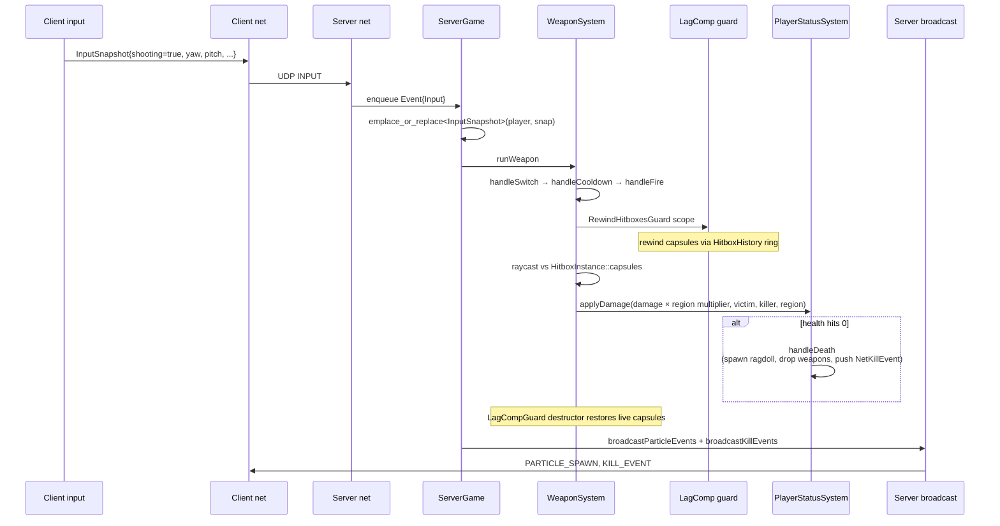
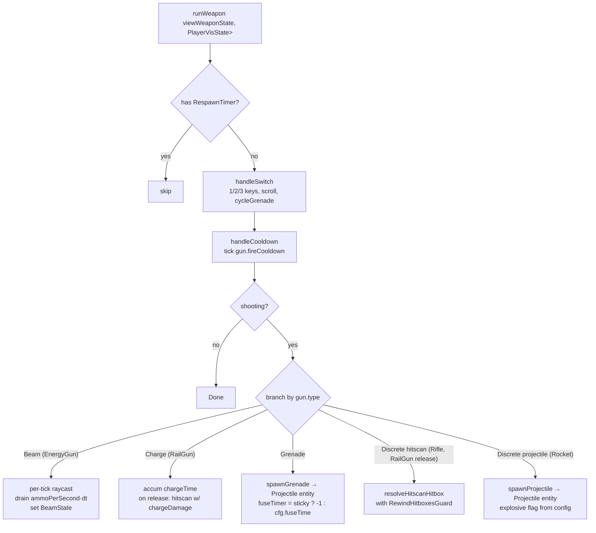
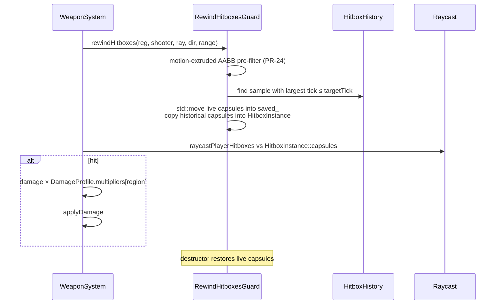
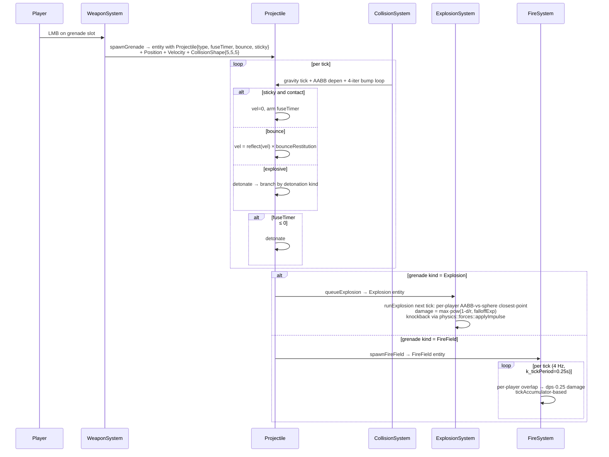
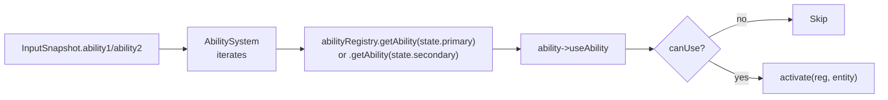
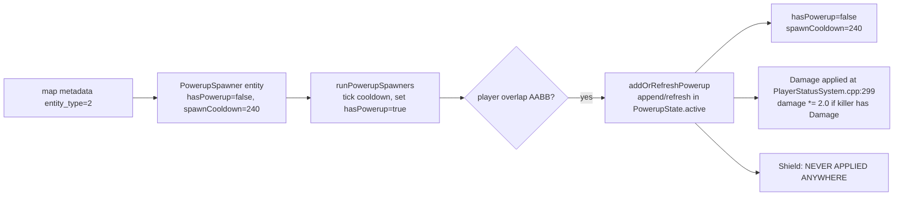
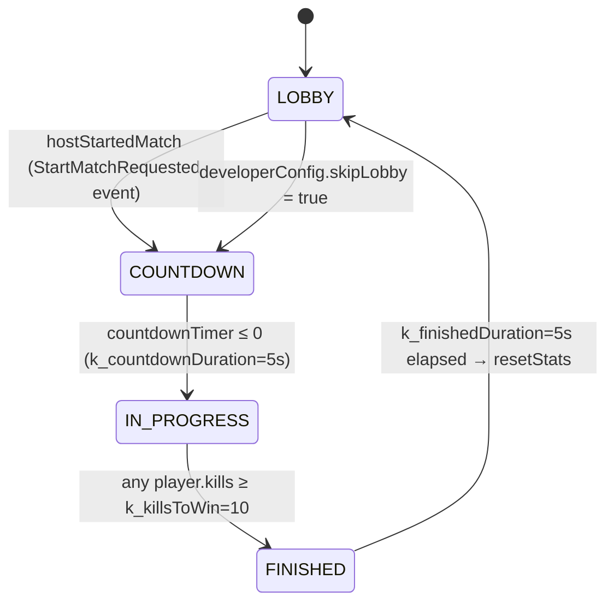

# Gameplay — weapons, abilities, match, powerups, grenades

Server-authoritative weapons, abilities, grenades, fire fields, powerups, and a small match-state controller. Damage flows through a single `applyDamage` entry point that handles armor → health → death → respawn.

Last verified against source: branch `core/collisions+wallrun` (2026-05-16).

---

## 1. Combat loop overview



---

## 2. Weapon catalogue

| Weapon | Type | Fire mode | Damage | Cooldown | Range / Speed |
|---|---|---|---|---|---|
| Rifle | hitscan, discrete | 0.10 s | 15 | 0.10 s | `physics::k_hitscanRange` |
| Rocket | projectile, explosive | 1.0 s | 200 (explosion) | 1.0 s | 3000 u/s, explosion radius 250, falloff^3, selfMult 0.4, maxKb 800 |
| RailGun | charge → hitscan | release | 150 | charge until release | hitscan |
| EnergyGun | continuous beam | 80 dps | DoT | per-tick drain | hitscan |
| HE grenade | grenade, fuse-3s, bounce 0.5 | manual throw | 120 + 500 kb in 200u | mag 1, reserve 99 | falloff 2.5 |
| Molotov | grenade, impact-detonate | manual throw | 0 (DoT) | mag 1 | FireField 5s, 30 dps, radius 250 |
| Impulse | grenade, sticky 1s fuse | manual throw | 0 | mag 1 | 1100 max kb, radius 350 |

`WeaponType` enum: `Rifle, Rocket, RailGun, EnergyGun, HEGrenade, Molotov, Impulse`.

`WeaponSlot` enum: `PRIMARY, SECONDARY, GRENADE`. `WeaponState{array<GunInstance,3>, current}`. `GunInstance{type, totalAmmo, currentMagAmmo, fireCooldown, chargeTime}`.

`WeaponConfig` table (`src/ecs/components/WeaponConfig.hpp`) holds per-type tunables: damage, fireCooldown, chargeTime, ammoPerSecond, hitscan flag, charge flag, beam flag, magazineSize, defaultAmmoCapacity. `ProjectileConfig` table holds explosionRadius, falloffExponent, maxKnockback, knockbackFalloffExponent, selfDamageMultiplier.

### Weapon-system branches



### Hitscan resolution



Hit-region multipliers (`DamageProfile`): Head 4.0×, Neck 2.0×, UpperTorso 1.0×, LowerTorso 1.0×, Arms 0.9×, Legs 0.75×.

---

## 3. Damage pipeline

`PlayerStatusSystem::applyDamage(reg, damage, victim, killer, region)`:

```mermaid
flowchart TD
  Start[applyDamage entry] --> Dead{victim has RespawnTimer?}
  Dead -- yes --> Skip[early return]
  Dead -- no --> Pwr{killer != victim AND killer has Damage powerup?}
  Pwr -- yes --> Mul[damage *= 2.0]
  Pwr -- no --> Reset
  Mul --> Reset[victim.healTimer = healCooldown]
  Reset --> Armor{armor > 0?}
  Armor -- yes --> AbsArm[armor -= damage<br/>overflow → health]
  Armor -- no --> Hlt[health -= damage]
  AbsArm --> Hlt
  Hlt --> Die{health <= 0?}
  Die -- yes --> Death[handleDeath<br/>ragdoll, drop weapons (PRIMARY+SECONDARY only),<br/>RespawnTimer{5.0},<br/>DeathInfo,<br/>NetKillEvent]
  Die -- no --> Done
  Death --> Lvl[updateAbilityLevel on killer<br/>(accumDamage += dmg, level up at 1000)]
```

Constants: `armorMax=100`, `healthMax=100`, `healCooldown=5.0`, `healingRate=20/s`, `k_spawnPointCooldown=5.0`, respawn timer 5.0 s, `dmgThreshold=1000` per level, `maxLevel=2`.

`handleDeath` increments killer's `kills`, victim's `deaths`. Self-damage doesn't credit a kill (guard `killer != victim`). `selfDamageMultiplier=0.4` is applied to explosion damage **before** the call, so self-rocket-jump does 80 dmg.

### Healing

`runPlayerStatus` ticks `healTimer` down; once ≤ 0, `applyHeal` regenerates `healingRate*dt` per second. Heal fills health first; overflow goes to armor.

> ⚠ Overflow-to-armor uses `=` not `+=`, so existing armor is **overwritten** by the overflow. See *potential-issues*.

---

## 4. Grenade pipeline



`GrenadeConfig`:

| Grenade | Damage | Radius | Fuse | Sticky | Bounce | Detonation |
|---|---|---|---|---|---|---|
| HE | 120, kb 500, falloff 2.5 | 200 | 3.0 s | no | 0.5 | Explosion |
| Molotov | 0; FireField dps 30, duration 5 s | 250 | -1 (impact) | no | — | FireField |
| Impulse | 0, kb 1100 | 350 | 1.0 s | yes | — | Explosion |

`isGrenadeType`, `canAcceptType` (slot↔type partition), `nextGrenadeType` (HE→Molotov→Impulse→HE) — defined in `GrenadeConfig.hpp`.

---

## 5. Abilities



### Registered abilities

`AbilityType { None, Dash, Grapple, Gravity, Recall }`.

Only `GrappleAbility` is **registered server-side** (`ServerGame.cpp:105`). `DashAbility` is **not registered**, and its `activate` body is a copy-paste of GrappleAbility (sphereCast forward 500u, sets `vis.grappleActive`, `sim.grapplePullDir`). Effectively two grapple variants if both were wired — but Dash isn't.

`AbilityState::primaryCooldown` / `primaryActive` / `secondaryCooldown` / `secondaryActive` fields exist but **nothing writes them**. The live grapple cooldown lives on `PlayerSimState::grappleCooldownActive` / `grappleCooldownTimer`, set by MovementSystem on detach. See *potential-issues*.

### Ability level

`AbilitySystem::dmgThreshold = 1000` damage; `maxLevel = 2`. `updateAbilityLevel` increments `level` per 1000 damage dealt.

---

## 6. Aim assist

Three layers:

### Gamepad (in-game) — `src/client/systems/GamepadAimAssistSystem.hpp`

Two-stage assist:

1. **Asymmetric slowdown** — refunds part of stick input when on target. Direction-aware via `dirDot`: moving toward target → less sticky; moving away → more sticky. Scaled by `proximity²`.
2. **Movement-tracking rotational pull** — applies a fraction (`rotationalCompensation=0.8`) of Δθ that the AABB anchor on the target moved between frames. Stationary enemies contribute zero pull. Hard cap `maxPullRate = 3.0 rad/s`.

Target selection: angular cone (3° inner / 8° outer, 3000u range), LOS clear via `physics::raycastWorld`. Server-blind: only modifies the local player's `InputSnapshot.yaw/pitch`.

### LD_PRELOAD accessibility — `aim_assist/aim_assist.cpp`

Separate library, completely outside the normal client. Two modes:

- View-angle snap on right-click for non-Rifle weapons
- **Silent packet-level mid-flight bullet correction** for Rifle — intercepts INPUT packets, rewrites yaw/pitch toward the closest target inside `HOMING_FOV` cone, zeros movement keys for that tick. Fire-rate gate by parsing `WeaponState` from incoming snapshots

---

## 7. Powerups

`PowerupType { Damage, Shield }` (`src/ecs/components/PowerupSpawner.hpp`).

| Powerup | Duration | Cooldown | Amount |
|---|---|---|---|
| Damage | 15 s | 240 s | 2.0× damage multiplier |
| Shield | 30 s | 240 s | 200 overshield |

### Pipeline



**Two bugs in `PowerupSystem::runPowerups`** (`src/ecs/systems/PowerupSystem.cpp:48-53`):

1. Loop var is a **copy by value** — decrement is lost.
2. `removePowerup` does `std::erase_if` on `powerups.active` *while iterating* — UB.

Net effect: **powerups never expire naturally**.

Also: `Shield` is never read anywhere. Pickup is a no-op.

---

## 8. Match flow



`MatchController` (`src/server/systems/MatchController.cpp`) ticks once per server tick. **Replicate-on-change** broadcast: `MatchStatePacket` only sent on phase / winner / second-boundary change or 64-tick heartbeat.

`resetStats` zeroes all `PlayerMatchStats`. Note: **does NOT reset Health / AbilityState / PowerupState** on match end (players carry wounds across matches). Combat is **not gated by MatchPhase** — players can kill during LOBBY/COUNTDOWN (`MatchController.cpp:19` acknowledges this). See *potential-issues*.

`winnerId` field exists on `MatchController` but is **never set** — always `-1` in `MatchStatePacket`. The win condition correctly flags `PlayerMatchStats::hasWon=true` but never propagates to `MatchController::winnerId`.

---

## 9. Respawn

`handleDeath` attaches `RespawnTimer{5.0}` and `DeathInfo`. Visible flag flipped off (`Renderable.visible=false`), `HitboxInstance` removed.

`runPlayerStatus` ticks `RespawnTimer.timeRemaining` down (allowing `skipRespawn=SPACE` to drop to 0). On 0:

1. `chooseRespawnPoint` — random among available; fallback lowest-cooldown.
2. `handleRespawn`:
   - clear `RespawnTimer`, `DeathInfo`
   - `Renderable.visible=true`
   - emplace_or_replace `Position`, `Velocity`, `Health`, `InputSnapshot`, `PlayerVisState`, `PlayerSimState`, `WeaponState` (default loadout: Rifle, RailGun, HE)
   - assigned RespawnPoint gets 5 s cooldown

⚠ Does **not** reset `AbilityState` or `PowerupState` on respawn — they persist across deaths.

`chooseRespawnPoint` constructs a fresh `std::random_device + std::mt19937` per call — non-deterministic by design (client doesn't predict respawn).

---

## 10. Weapon spawners & dropped weapons

| System | Lifetime |
|---|---|
| `WeaponSpawnerSystem` | Static spawners with `weaponCooldownTime=10.0`. Two pickup modes: overlap auto-refill same-type slot, OR look-and-press-F replace equipped slot |
| `DroppedWeaponSystem` | Drops from `handleDeath` have `k_droppedWeaponLifetime=30.0` despawn timer. Same dual pickup mode (overlap-refill + F-replace) |

⚠ `handleDeath` only drops PRIMARY+SECONDARY — grenade slot ammo is forfeited.

`PickupGeometry.hpp` shared constants: `k_pickupRange=140.0`, `k_pickupMaxAngleDeg=12.0`.

---

## 11. Ragdolls

`spawnRagdoll(registry, character)` (`src/ecs/systems/RagdollSystem.cpp`):

- 15 capsule rigid bodies sized to a 72-unit Mixamo character
- 14 joints: 6× ConeTwist (shoulders/hips/neck), 4× Hinge (elbows/knees), 4× Point (spine/wrists/ankles)
- Total mass ~80 kg
- Idempotent (early-return if `Ragdoll` component already exists)
- Inherits character linear velocity

`runRagdolls` only increments `Ragdoll::age`. **Nothing destroys ragdoll entities** — first death's corpse stays forever; subsequent deaths re-trigger `spawnRagdoll` which idempotently no-ops. See *potential-issues*.

---

## 12. Triggers

`TriggerSystem::runTriggers(reg, isPredictedClient)` walks `TriggerVolume`s and diffs current overlap vs the stored `TriggerOverlapSet` to emit `Enter/Stay/Exit` events through `physics::events::pushTriggerEvent`.

⚠ **The consumer API `triggerEvents()` is defined but never called.** Trigger events are produced and discarded.

---

## 13. Server-only vs client-only

| Side | Systems |
|---|---|
| Server-only | `runWeapon` (authoritative damage), `runAbility`, `runExplosion`, `runFireField`, `runPlayerStatus`, `runWeaponSpawners`, `runDroppedWeapons`, `runPowerupSpawners`, `runPowerups`, `runRagdolls`, `runDynamics`, `runSpawnPointCooldowns`, `pushHitboxHistory`, `MatchController.update` |
| Both | `runMovement`, `runCollision`, `updateHitboxes`, `runTriggers` (client passes `isPredictedClient=true`) |
| Client-only | Input sampling, prediction, reconciliation, aim assist |

`WeaponSystem` itself is shared so client can run prediction (animate VFX, emit `SHOT_INTENT`), but damage and projectile spawn only "really" happen on the server.

---

## 14. Key files

| File | Role |
|---|---|
| `src/ecs/systems/WeaponSystem.cpp` | Weapon branch, hitscan, projectile spawn |
| `src/ecs/components/WeaponConfig.hpp` | Per-type tunables |
| `src/ecs/components/WeaponState.hpp` | `GunInstance` per slot |
| `src/ecs/components/GrenadeConfig.hpp` | Grenade tunables + slot/type partition |
| `src/ecs/systems/ExplosionSystem.cpp` | Radial damage + knockback |
| `src/ecs/systems/FireSystem.cpp` | FireField DoT |
| `src/ecs/systems/HitboxSystem.cpp` | Build world capsules |
| `src/ecs/systems/LagCompensation.hpp` | `RewindHitboxesGuard` RAII |
| `src/ecs/abilities/*` | Ability impl + registry |
| `src/ecs/systems/AbilitySystem.cpp` | Dispatcher |
| `src/ecs/systems/PowerupSystem.cpp` | (broken — see issues) |
| `src/ecs/systems/PowerupSpawnerSystem.cpp` | Spawner overlap |
| `src/ecs/systems/PlayerStatusSystem.cpp` | applyDamage, applyHeal, handleDeath, handleRespawn |
| `src/ecs/systems/MatchSystem.cpp` | Win check, resetStats |
| `src/server/systems/MatchController.cpp` | State machine |
| `src/ecs/systems/RagdollSystem.cpp` | Spawn / age |
| `src/ecs/systems/TriggerSystem.cpp` | Overlap diff |
| `src/client/systems/GamepadAimAssistSystem.hpp` | Two-stage aim assist |
| `aim_assist/aim_assist.cpp` | LD_PRELOAD accessibility |

See [potential-issues.md](potential-issues.md) for the full list of known bugs in this layer.
