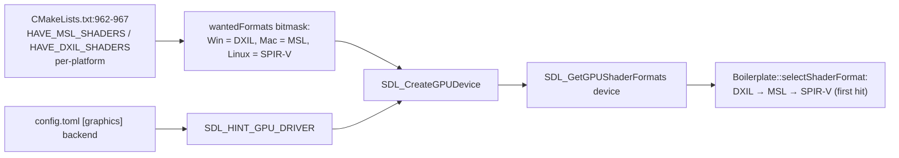
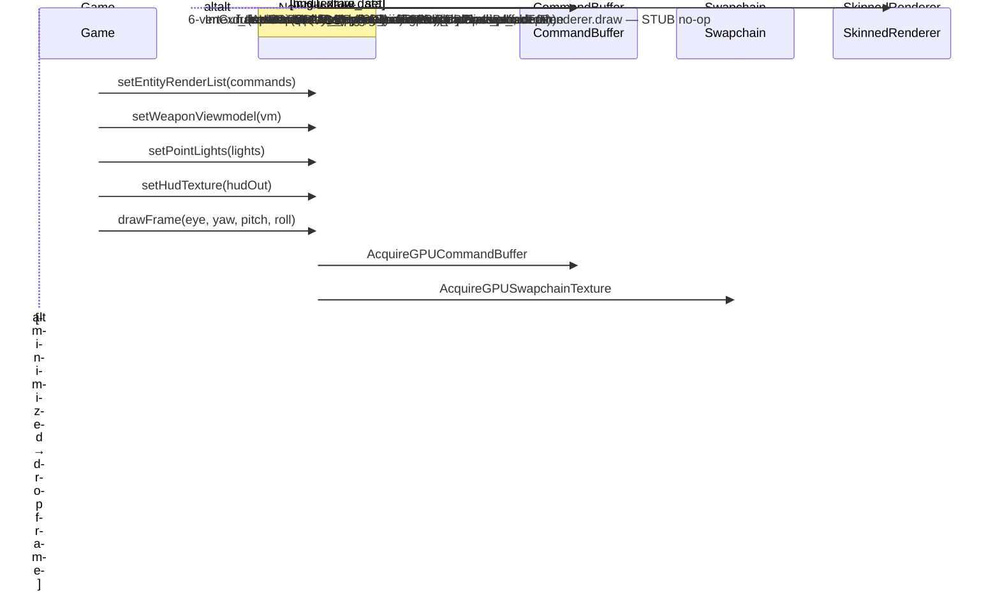
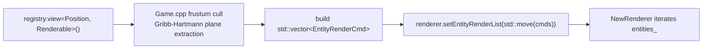
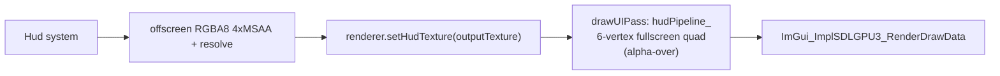

# Graphics

SDL3 GPU API renderer (Vulkan / Metal / D3D12). The codebase is **mid-migration** to `renderer-new/`; only the **geometry pass** and **HUD blit** pass are actually wired today, plus ImGui on top.

Last verified against source: branch `core/collisions+wallrun` (2026-05-16).

> The 'old' renderer at `src/renderer/` has been removed. `src/client/renderer-new/` is the active implementation. The full legacy shader set in `shaders/` (PBR / shadows / IBL / GTAO / bloom / SSR / volumetrics / SMAA / particles / WBOIT) is **not loaded** by the new renderer. Only `shaders-new/` (4 files) is consumed.

---

## 1. Backend selection



Platform defaults: Windows → D3D12, macOS → Metal, Linux → Vulkan. User override via `config.toml`:

```toml
[graphics]
backend = "auto" | "direct3d12" | "vulkan" | "metal"
```

---

## 2. Frame structure

`NewRenderer::drawFrame(eye, yaw, pitch, roll)` (`src/client/renderer-new/NewRenderer.cpp:179-238`):



Telemetry: `lastAcquireMs_`, `lastRecordMs_`, `lastSubmitMs_` via `SDL_GetPerformanceCounter`.

---

## 3. Resources

| Resource | Owner | Notes |
|---|---|---|
| `device_` | NewRenderer | Created with `debug_mode=false` |
| `geometryPipeline_` | NewRenderer | Color = swapchain format (**NOT** the planned HDR R16G16B16A16) |
| `hudPipeline_` | NewRenderer | Premul-alpha blit |
| Depth target | NewRenderer | D32_FLOAT, recreated on swapchain size change |
| `sampler_` / `hudSampler_` | NewRenderer | Identical linear-repeat |
| Default texture | NewRenderer | `assets/404.jpeg` |
| `Asset::meshes_/models_/textures_/materials_` | **Global static maps** in `Asset.hpp` | Released by `quit()` walking `meshes_` but **`textures_` never iterated → leak** |
| Skinned palette SSBO / instances SSBO | SkinnedRenderer | Grown on demand by `ensureSsbos` |

**Cull mode is `NONE`** in every pipeline (`Boilerplate.cpp:216`) — doubles fragment work and renders inside-out geometry.

---

## 4. Camera

`NewCamera` lives inside `NewRenderer` (no ECS Camera component). Game.cpp passes `(eye, yaw, pitch, roll)` floats per frame.

| Field | Value |
|---|---|
| FOV | 60° vertical |
| Near / Far | 5 / 15000 Quake units |
| Aspect | from swapchain dims |
| Depth convention | `GLM_FORCE_DEPTH_ZERO_TO_ONE` → `[0,1]` |
| Forward at yaw=0 | `(0, 0, +1)` |
| Forward formula | `(sin(yaw)·cos(pitch), -sin(pitch), cos(yaw)·cos(pitch))` |
| Up | rolled around forward (used for wallrun camera tilt) |

---

## 5. Shaders

### Active (`shaders-new/`)

Only 4 GLSL files actually loaded:

| Shader | Role |
|---|---|
| `geometry.vert` | MVP via two UBOs (`Camera{view_projection}`, `Object{model}`). Normals via `transpose(inverse(mat3(model)))` |
| `geometry.frag` | Single hardcoded directional light + albedo. **Multiplies albedo by `normal*0.5+0.5`** (debug-style normal tint, likely unintended) |
| `hud.vert` | Synthesizes fullscreen quad from `gl_VertexIndex` |
| `hud.frag` | Texture sample |

### Compile pipeline

```text
.vert/.frag  ── glslang ──→  .spv  ── shadercross ──→  .dxil (Win) / .msl (Mac)
```

Vendored via `FetchContent` (`glslang-standalone`, `SDL_shadercross`). Outputs land in `build/<preset>/shaders/` and `build/<preset>/shaders-new/` via `POST_BUILD copy_directory`. Entry point `main` for SPIR-V/DXIL, `main0` for MSL (spirv-cross rename).

**No hot reload** — restart required to pick up shader changes.

### Legacy (`shaders/`)

45 files supporting the historical pipeline (PBR Cook-Torrance, CSM shadow, IBL, GTAO, bloom, SSR, volumetrics, motion vectors, SMAA T2x, CAS, WBOIT, SSS, particle billboards / ribbon / smoke / tracer / lightning_arc / hitscan_beam, decals, SDF text). Compiled but **no pipeline in the new renderer consumes them**. `pbr_skinned.vert` + `shadow_skinned.vert` are the canonical reference shader layout `SkinnedRenderer` was designed to load.

---

## 6. Asset loading interface

The renderer is **not an ECS system** — `Game.cpp` is the bridge:



Frustum culling is done in **Game**, not the renderer. The renderer just iterates the supplied list.

### Asset registries

Two parallel systems by design — see [asset-loading.md](asset-loading.md):

1. **`Asset::meshes_` / `models_` / `textures_` / `materials_` / `modelInstances_`** — global `inline std::unordered_map`s in `Asset.hpp`, keyed by FNV-1a 32-bit hashes of filenames. Renderer's internal authority.
2. **`AssetRegistry`** — game-facing name → modelIndex directory used by gameplay code.

`loadSceneModel(filename, pos, scale, flipUVs, excludeNodesContaining)`:

```text
1. FNV hash filename → ModelIdInt
2. resolve full path via SDL_GetBasePath()
3. AssetLoader::loadModel — Assimp scene → ModelNode/Element tree, decode tex
4. updateModelTransformCache → DFS world transforms
5. append default ModelInstance with drawInScenePass=true
6. createMeshBuffers per element (VB + IB)
7. createTextureRGBA8 lazily for each material's tex
8. uploadBuffers (one transfer buffer, one copy pass)
9. SDL_WaitForGPUIdle (SYNCHRONOUS, on the main thread)
```

The synchronous wait + Assimp parse on the main thread means several seconds of frozen window at startup with ~10 models.

---

## 7. Viewmodel rendering

The local player's FP weapon is drawn LAST inside the geometry pass:

```mermaid
flowchart LR
  Game[Game.cpp:2384..<br/>builds ViewmodelParams per WeaponType] --> Tf["camera basis + sway + recoil spring"]
  Tf --> Vm[WeaponViewmodel{modelIndex, transform, visible}]
  Vm --> Set["renderer.setWeaponViewmodel(vm)"]
  Set --> Draw[NewRenderer::drawWeapon<br/>uses same geometryPipeline_ as world]
```

There's no separate viewmodel FOV, no depth bias, no overdraw mask. The legacy `tonemap.frag` uses an alpha channel as a "scene mask" so post-FX skip weapon pixels, but the new renderer has no post chain so that's moot today.

---

## 8. Skinned characters

**Designed but not wired.** Detail:

- CPU LBS backend exists (`SkinningBackend.cpp`) — never invoked.
- `SkinnedRenderer` per-mesh `vb` (`ModelVertex`), `boneVb` (`BoneInfluence`), `ib` allocated in `setRig`. Per-frame palette SSBO + instances SSBO grown by `ensureSsbos`.
- `SkinnedRenderer::draw` body is **commented-out pseudocode** (`SkinnedRenderer.cpp:264-316`).
- `Game.cpp` never calls `renderer->skinned().setRig(...)` or `setFrame(...)` — confirmed by grep.

**Net effect**: animated characters do not render in the new pipeline. Animations compute correctly and propagate to ECS for hitboxes / `AnimSnapshot`; they just never reach the GPU.

---

## 9. Particles

Same status as skinned: designed but not wired. `Game.cpp:201` has `// TODO(renderer-migration): renderer->setParticleSystem(&particleSystem);` commented out. `NewRenderer::setParticleSystem` captures the pointer but never calls `uploadToGpu` / `render`. The full particle subsystem (covered in [particles-vfx.md](particles-vfx.md)) exists and ticks every frame but never reaches the GPU through the new renderer.

---

## 10. HUD pass

The HUD renders into its own offscreen 4× MSAA target inside `Hud::render`, then `NewRenderer::drawUIPass` blits it as a fullscreen quad after the geometry pass (see [hud.md](hud.md)):



---

## 11. Configuration

`GraphicsConfig` (`src/client/renderer-new/GraphicsConfig.cpp`):

| Key | Default |
|---|---|
| `backend` | `auto` (Win→D3D12, Mac→Metal, Linux→Vulkan) |

ImGui suppression via `GROUP2_NO_IMGUI` env var.

Other knobs are setter API on `NewRenderer` but several are **data-capture stubs**: `setVSync`, `requestScreenshot`, `loadHDRSkybox`, `scanHDRFiles`, `setModelEmissive`, `setPointLights` are TODO. 14 `TODO(graphics)` markers in `NewRenderer.cpp` + `SkinnedRenderer.cpp`.

---

## 12. Key files

| File | Role |
|---|---|
| `src/client/renderer-new/NewRenderer.cpp` | Frame loop, two pipelines wired, viewmodel |
| `src/client/renderer-new/Boilerplate.cpp` | Device / pipeline / sampler setup |
| `src/client/renderer-new/Camera.cpp` | View/projection |
| `src/client/renderer-new/RendererTypes.hpp` | `EntityRenderCmd`, `WeaponViewmodel`, etc. |
| `src/client/renderer-new/ShaderUtils.cpp` | Shader loader (SPV / MSL / DXIL by suffix) |
| `src/client/renderer-new/SkinnedRenderer.cpp` | Designed-but-not-wired skinned draw |
| `src/client/renderer-new/AssetLoader.cpp` | Assimp wrapper |
| `src/client/renderer-new/Asset.hpp` | Global static asset maps |
| `src/client/renderer-new/GraphicsConfig.cpp` | TOML config |
| `shaders-new/` | 4 GLSL files actually loaded |
| `shaders/` | 45 legacy GLSL files, not loaded by `NewRenderer` |

See [asset-loading.md](asset-loading.md) for the asset pipeline, [animations.md](animations.md) for the animation system that feeds skinned characters, and [potential-issues.md](potential-issues.md#graphics-rendering) for known regressions.
