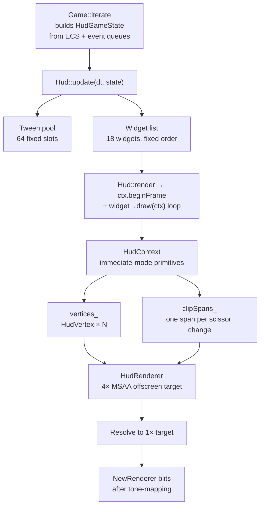
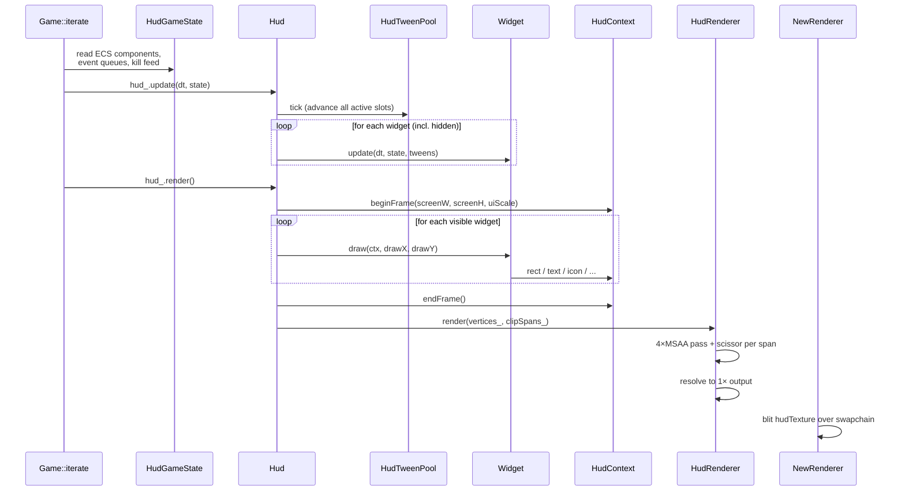
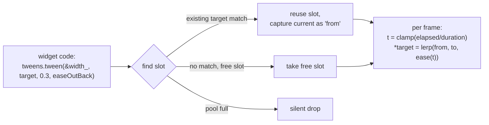
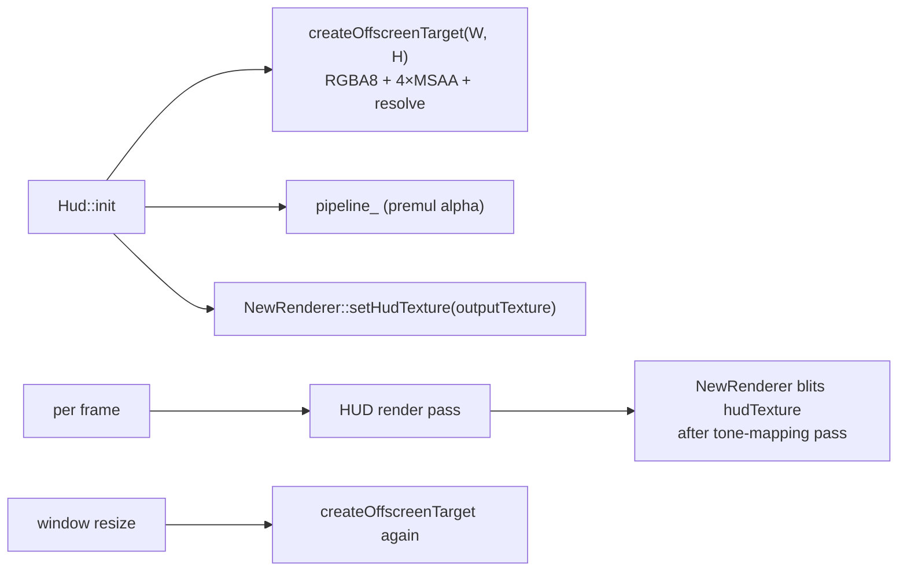

# HUD

A 4-layer immediate-mode HUD with retained per-widget state, a tween pool for animation, and a dedicated 4× MSAA off-screen target that the renderer blits over the swapchain.

Last verified against source: branch `core/collisions+wallrun` (2026-05-16).

---

## 1. Architecture

### Layers

1. **Widget layer** — `src/client/hud/HudWidget.hpp`. `HudWidget` is a plain struct with `visible`, `anchor`, `offsetX/Y`, `width/height`, `uiScale_` and two virtuals: `update(dt, state, tweens)` and `draw(ctx, drawX, drawY)`. Each widget owns its retained state (tween targets, history rings).
2. **Tween layer** — `src/client/hud/HudTween.hpp`. Fixed pool of 64 slots, no heap allocations. Each entry interpolates a single `float*` from a captured `from` toward `to` over a `duration` via a function-pointer ease (`HudEaseFn = float(*)(float)`). Slot lookup walks first for an existing target-pointer match, else first-free; **pool full → silent drop**. Easings: `easeLinear`, `easeInQuad`, `easeOutQuad`, `easeInOutQuad`, `easeOutBack`, `easeOutElastic`.
3. **Context layer** — `src/client/hud/HudContext.hpp`. Immediate-mode draw API: `rect`, `rectOutline`, `roundedRect`, `rotatedRect`, `gradientRect`, `triangle`, `triangleColors`, `polyline`, `bar`, `text`, `measureText`, `icon`, `crosshair`, `vignette`, `pushClipRect`/`popClipRect`. All primitives push into `vertices_` (`HudVertex` = 48 B, 5 attributes). Clip changes flush a span `{startVertex, vertexCount, x, y, w, h}` into `clipSpans_`. Vertex `texMode` encodes the shader path: `0=solid, 1=SDF text, 2=sprite, 3=SDF rounded rect, 4=radial vignette`.
4. **GPU layer** — `src/client/hud/HudRenderer.cpp`. Renders all batched geometry into an offscreen RGBA8 target with 4× MSAA + resolve. Premultiplied-alpha blend. One `SDL_DrawGPUPrimitives` call per clip span, with a GPU scissor set per span. The HUD output texture is registered with `NewRenderer::setHudTexture` and blitted over the swapchain after tone-mapping.

---

## 2. Coordinates & style

- Top-left origin, pixel space.
- Scaled per frame from a 1920x1080 reference canvas: `uiScale_ = min(screenW / 1920.f, screenH / 1080.f)`. Every widget multiplies its `offsetX/Y`/`width`/`height` by this when rendering, preserving proportions while keeping HUD chrome inside narrower or unusual aspect ratios.
- 9-way anchor (`HudAnchor`): TopLeft, Top, TopRight, Left, Center, Right, BottomLeft, Bottom, BottomRight. Resolved in `Hud::resolveAnchor`.

### Style tokens (`VoidfallStyle.hpp`)

| Token | Color |
|---|---|
| `k_amber` (primary) | `{1.00, 0.71, 0.18}` |
| `k_cyan` (shield) | `{0.45, 0.78, 0.96}` |
| `k_red` (health) | as named |
| Weapon-type accents | AR teal, Sniper purple, etc. via `weaponTypeAccent(int)` |

Shared style helpers: `drawCornerBrackets`, `drawPanel`, `drawTrailBar`, `drawGradientTrailBar` (ghost-trail bar with held-then-drain on damage), `drawKeyTab`, `lerpColor`, `withAlpha`.

> The current palette is **amber/cyan**, not pure Apex-cyan. The legacy memory note describing the HUD as "Apex-style cyan" is outdated.

---

## 3. Per-frame flow

Update is called **for hidden widgets too**, intentionally — keeps e.g. Scoreboard data fresh so the TAB toggle is instant.

The HUD owns its own command buffer, render pass, MSAA target, resolve target, pipeline, vertex/transfer buffers. The HUD pass is fully separate from the main scene pass.

---

## 4. Widget catalog

Built in `Hud::init` (`Hud.cpp:170-213`), back-to-front order. Each is `std::unique_ptr<HudWidget>` in a fixed `std::vector`. There is no dynamic add/remove API.

Examples (non-exhaustive):

| Widget | Anchor | Purpose |
|---|---|---|
| Vignette | full | damage / death / shield-break overlay |
| Crosshair | center | gap/length crosshair |
| HitMarker | center | tween-driven hit confirm flash |
| HealthBar | bottom-left | shield/health/heal bars |
| WeaponHud | bottom-right | weapon name, ammo, switch state |
| AbilityCharge | bottom-right | dash/grapple cooldown wheel |
| KillFeed | top-right | scrolling kill events (3-5 lines) |
| MatchHeader | top | round timer, score |
| DamageIndicator | center | radial direction-of-damage arcs |
| EnemyWorldHealthBar | center | world-space (NOT screen-space) bars |
| Scoreboard | center | TAB-toggled |
| BuyMenu | center | B-toggled — **stub list, no purchase wiring** |
| DamageAccumWidget | center | recently dealt damage popups |

Debug-only widgets are in `src/client/hud/debug/HudDebugPanel.cpp`, exposed via ImGui (`F2`) — see [debug-ui.md](#) (TODO future doc).

---

## 5. Tween pool

Capacity 64. Slots are keyed by the `float*` pointer, so retargeting an existing tween re-uses the slot and re-captures the current value as the new `from`.

---

## 6. Event handling

Only two key events are handled by `Hud::processEvent`:

- `TAB` → toggle Scoreboard (via `dynamic_cast<Scoreboard*>`)
- `B`  → toggle BuyMenu (via `dynamic_cast<BuyMenu*>`)

All other input flows in via the per-frame `HudGameState` snapshot. Hit confirms / damage events are passed as one-frame spans (`hudState.hitConfirms`, `hudState.damageEvents`) and consumed by widgets the same frame.

> The HUD does **not** subscribe to the `entt::dispatcher` event bus that gameplay code uses. Game code is responsible for filling `HudGameState` from both ECS components and event queues every frame.

---

## 7. Renderer integration

Shaders: `hud.vert/.frag` (geometry) and `hud_blit.frag` (sample resolve target onto swapchain). Loaded by suffix (`.spv` / `.msl` / `.dxil`) by `HudRenderer::loadShader`.

---

## 8. Key files

| File | Role |
|---|---|
| `src/client/hud/Hud.{cpp,hpp}` | Top-level driver, widget list, anchor resolve |
| `src/client/hud/HudRenderer.{cpp,hpp}` | Offscreen MSAA target, scissor-per-span draws |
| `src/client/hud/HudContext.{cpp,hpp}` | Immediate-mode primitive API |
| `src/client/hud/HudTween.{cpp,hpp}` | 64-slot tween pool |
| `src/client/hud/HudTypes.hpp` | `HudGameState`, `HudVertex`, anchor enum |
| `src/client/hud/HudWidget.hpp` | Widget base struct |
| `src/client/hud/HudIcons.{cpp,hpp}` | Procedural icon rasterization (placeholder for atlas) |
| `src/client/hud/VoidfallStyle.hpp` | Palette & shared style helpers |
| `src/client/hud/widgets/` | All 18+ widget implementations |
| `src/client/hud/debug/HudDebugPanel.{cpp,hpp}` | ImGui tweaker UI |

See [potential-issues.md](potential-issues.md#hud) for known smells: missing icon atlas (`HudContext::icon` returns a 1×1 white placeholder), key-up-on-focus-loss bug for TAB/B, hardcoded weapon callsign "ARC-9" in KillFeed, no UTF-8 in the SDF atlas, etc.
