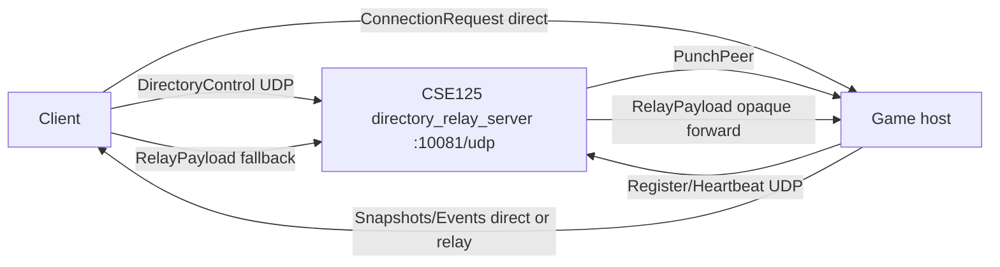
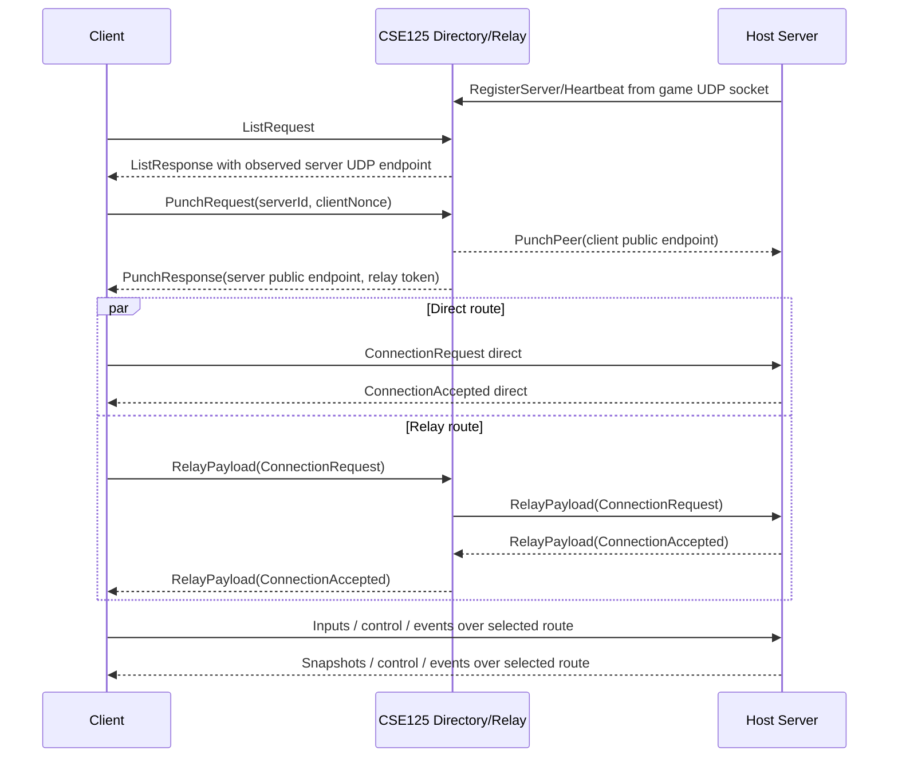

# Networking

Authoritative client/server multiplayer over a UDP-first session transport.
The normal runtime path is:

```text
client/server app payloads
  -> UdpSessionTransport
  -> direct UDP route when validated
  -> CSE125 UDP relay fallback when direct is unavailable
```

Last verified against source: branch `codex/udp-first-networking` (2026-05-18).

---

## 1. Goals

- No port forwarding for home-hosted game servers.
- UDP for gameplay, lobby/control, server browser, ping, and disconnect.
- Direct NAT-punched route preferred; relay keeps joins working when direct UDP fails.
- Stable gameplay identity through session IDs, not IP endpoints.
- Transport boundary remains clean enough for a later Steam Networking Sockets adapter.

The legacy TCP path is still behind configuration as a rollback during migration, but new code should target `UdpSessionTransport`.

---

## 2. Runtime Pieces



### Game Client

- Fetches server list from the directory over UDP.
- For global joins, requests NAT assist and configures relay fallback.
- Opens one UDP session socket and connects through direct and relay candidates.
- Delivers app payloads to gameplay in the existing `[PacketType][payload...]` format.

### Game Server

- Opens one UDP session socket on the game port.
- Registers and heartbeats to the CSE125 directory from that same socket.
- Accepts direct connection requests and relay-wrapped connection requests.
- Sends snapshots, reliable events, lobby/control, and disconnect over session channels.

### Directory/Relay

- One public UDP port, default `10081`.
- Stores active advertised servers with observed public UDP endpoint.
- Answers browser list and punch requests.
- Forwards opaque relay envelopes by `(serverId, clientNonce)`.
- Validates client-to-relay envelopes with short-lived relay tokens issued by `PunchResponse`.
- Does not parse gameplay payloads inside relay envelopes.

---

## 3. UDP Session Transport

`src/network/transport/UdpSessionTransport.*` owns:

- handshake and 64-bit connection IDs
- route selection and relay wrapping
- keepalive and timeout
- channel sequencing
- selective acks with `seq`, `ack`, and `ackBits`
- reliable retransmit queues
- unreliable sequenced stale-drop
- fragmentation/reassembly
- transport stats

Application payloads remain unchanged: the first byte is still `PacketType`.
Reliability is chosen by transport channel:

| Channel | Use |
|---|---|
| `InputUnreliable` | client input, shot intents, ping |
| `SnapshotUnreliableSequenced` | full/delta snapshots, stale-drop |
| `ControlReliableOrdered` | assign ID, lobby, ready/start, disconnect |
| `EventReliableOrdered` | kill events, particles, match state, shot debug |

---

## 4. Packet Header V2

Every UDP datagram starts with the 36-byte protocol v2 header in explicit little-endian order:

```text
u16 magic        0x3247
u8  version      2
u8  kind         Payload / handshake / relay / directory
u64 connectionId
u32 sequence
u32 ack
u32 ackBits
u16 routeId      0 direct, non-zero relay/future adapters
u8  channel
u8  flags        fragmented, encrypted future, relay preferred
u16 fragmentInfo hi8 index, lo8 count
u16 fragmentGroup
u32 reserved
```

`k_maxPacketBytes` is 1200. Large direct payloads are fragmented at the transport layer. Relay payloads are fragmented before wrapping so each relay envelope remains within the outer MTU budget.

---

## 5. Global Join Flow



The transport prefers direct traffic unless `transport.force-relay = true`.
If direct packets stop arriving, keepalive timeout disconnects the route; relay fallback can carry the session without changing gameplay connection IDs.

---

## 6. Configuration

Relevant `config.toml` keys:

```toml
[transport]
use-udp-sessions = true
allow-legacy-tcp-fallback = true
force-relay = false

[global-discovery]
enabled = true
directory-host = "cse125.ucsd.edu"
directory-udp-port = 10081
advertise-server = true
server-name = "Group2 Server"
max-players = 16
relay-fallback-delay-ms = 450
```

Ops requirement: CSE125 must allow inbound UDP on the selected directory/relay port. If that UDP port is blocked, no UDP relay can be guaranteed.

---

## 7. Steam Compatibility

Gameplay code talks to the session transport interface, not raw IP identity.
That keeps a future Steam adapter straightforward:

- Steam lobby/server discovery can replace the CSE125 directory.
- Steam Datagram Relay can replace the CSE125 relay.
- `ISteamNetworkingSockets` can own the connection-oriented transport while preserving app payloads and gameplay session IDs.

---

## 8. Tests

Current focused test:

```bash
cmake --build --preset release --target udp_session_tests
ctest --test-dir build/release -R udp_session_tests --output-on-failure
```

Main build smoke:

```bash
cmake --build --preset release --target group2 server directory_server clientbot
```

Recommended manual integration passes:

- Local loopback: directory + server + client; verify browser listing, join, lobby, match start, snapshots, input, events, disconnect.
- Forced relay: set `transport.force-relay = true`; verify join and gameplay through relay.
- WAN smoke: run `tools/global_directory_server.py --udp-port 10081` on CSE125, host from a home network, join from a second network with no game-host port forwarding.
