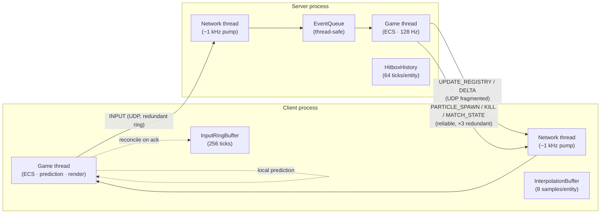
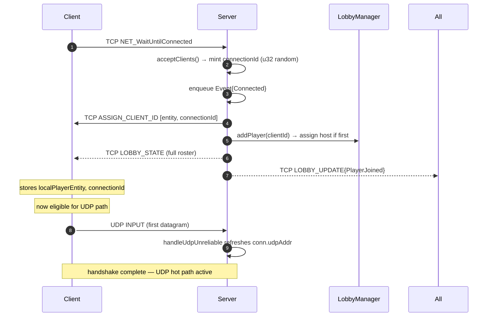
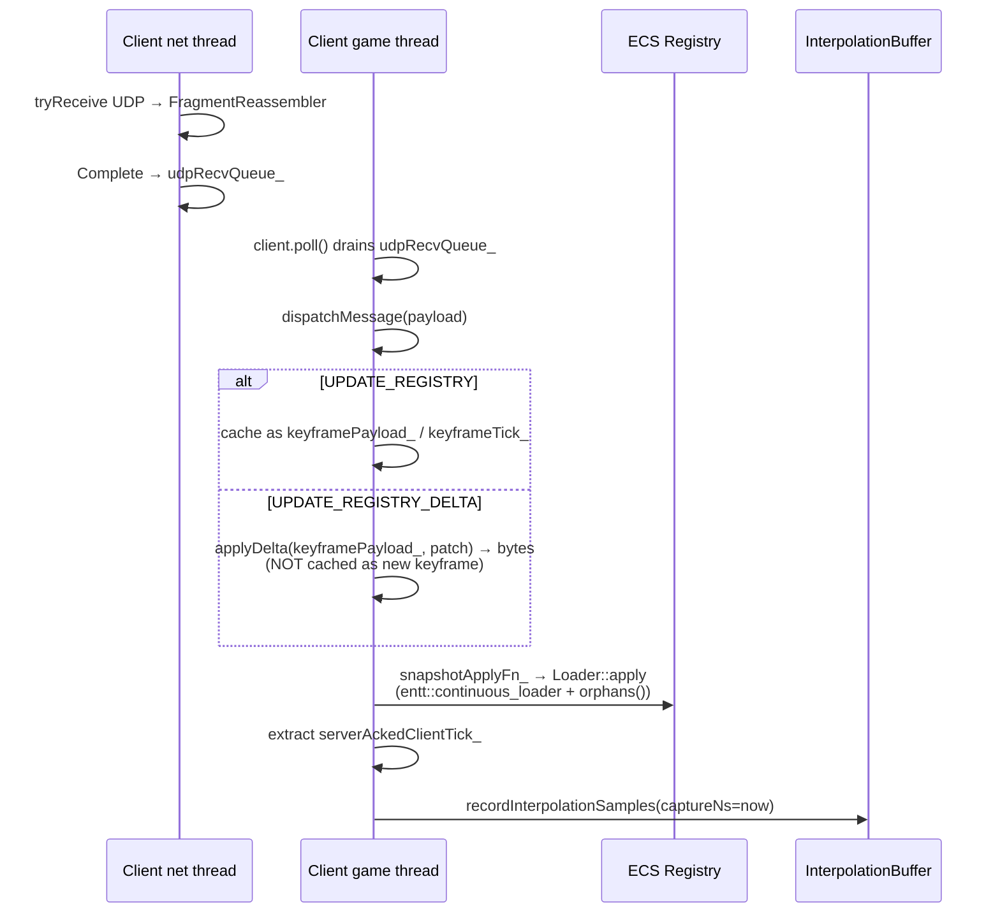
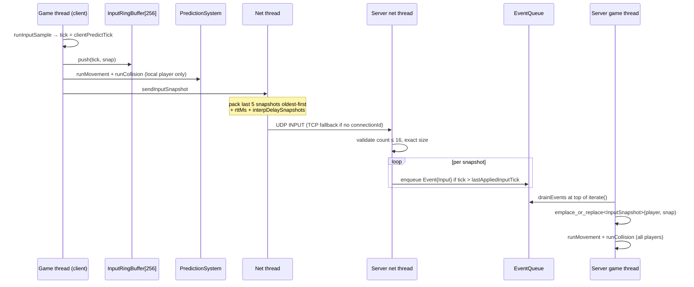
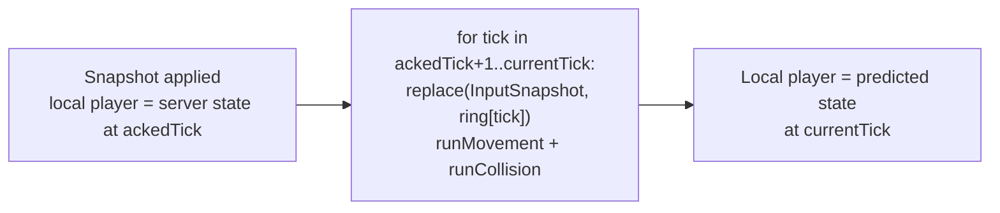
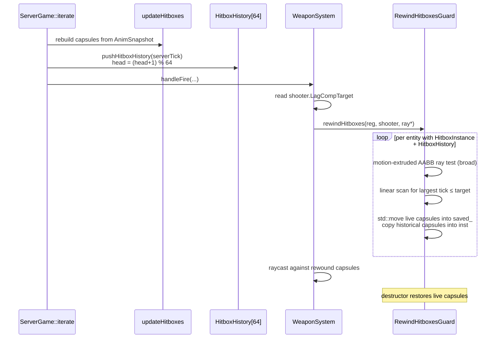

# Networking

Authoritative server, UDP-preferred transport with a TCP control sidecar, client-side prediction with full input replay, lag-compensated hitscan, and snapshot delta-RLE over a single keyframe baseline.

Last verified against source: branch `core/collisions+wallrun` (2026-05-16).

---

## 1. Overview



The server holds the authoritative ECS registry; the client mirrors a subset (the **Synced tuple**) and additionally runs the same `runMovement + runCollision` locally for the local player only.

---

## 2. Transport

### 2.1 Sockets

| Channel | Library | Use |
|---|---|---|
| TCP stream | `SDL3_net` `NET_StreamSocket` | Reliable control: handshake, lobby, snapshot fallback when UDP unavailable |
| UDP datagram | `SDL3_net` `NET_DatagramSocket` | Hot path: snapshots, inputs, ping, particle/kill events |

The TCP socket is established first (`NET_CreateClient` + `NET_SetStreamSocketNoDelay`), then the client opens a UDP socket on any free local port. The server binds UDP to the same port as TCP.

Both sides run a dedicated **network thread** that pumps at ~1 kHz (`SDL_Delay(1)`). The game thread never touches sockets directly.

### 2.2 Packet header — 16 bytes, packed, little-endian

```text
+--------+--------+--------+--------+--------+--------+--------+--------+
| magic (u16)     | ver(u8)| kind(u8)| connectionId (u32)             |
+--------+--------+--------+--------+--------+--------+--------+--------+
| sequence(u16)   | chan(u8)| flags(u8)| fragInfo (u16) | _pad (u16)  |
+--------+--------+--------+--------+--------+--------+--------+--------+
```

| Field | Type | Meaning |
|---|---|---|
| `magic` | u16 | `0x3247` — protocol signature (note: header comment claims `0x4732`; the constant is correct, the comment is wrong — see *potential-issues* §N-1) |
| `version` | u8 | `1` |
| `kind` | u8 | `PacketKind` — only `Payload` is actually used (handshake is over TCP) |
| `connectionId` | u32 | Server-minted random per connection. `0` pre-handshake |
| `sequence` | u16 | Per-`(connection, channel)` monotonic |
| `channel` | u8 | `Unreliable=0`, `UnreliableSequenced=1`, `ReliableOrdered=2`, `ReliableUnordered=3` |
| `flags` | u8 | bit 0 = fragmented, bit 1 = encrypted (unused) |
| `fragmentInfo` | u16 | `(index << 8) | count`. Caps at 256 fragments (8-bit count). |

Caps: `k_maxPacketBytes = 1200`, `k_maxPayloadBytes = 1184`.

### 2.3 Fragmentation & reassembly

`UdpEndpoint::sendFragmented(redundancy)`:

- payload ≤ 1184 B: single-datagram fast path (still honors `redundancy`)
- payload > 1184 B: splits into N fragments with same `(connection, channel, sequence)`, varying `fragmentInfo`. Iteration order is **fragment-major** across redundancy copies — better cache behavior + decorrelates from burst loss.

`FragmentReassembler` holds **one in-progress set per connection**. New sequence arrives → resets and starts fresh. Same sequence with mismatched count → resets. Duplicate slots are idempotent. When all slots filled, payload is concatenated in index order.

### 2.4 TCP framing — `MessageStream`

Wire format on TCP: `[u32 length][payload]`. The length prefix is **host-endian** — both sides must share endianness.

`pumpReads` drains the kernel buffer fully in 16 KB chunks. `drainComplete` walks `recvBuf` from `recvHead`, invoking a callback per complete message. Head-offset compaction kicks in above 64 KB head or 50 % wasted prefix.

**Caveat**: `recvBuf` is unbounded, and the length prefix is read without an upper bound — a malicious peer can DoS by sending `[length=0xFFFFFFFF]` then withholding payload. See *potential-issues*.

---

## 3. Packet types

All packets are tagged with a `PacketType` enum byte at the start of payload (after the header).

| Type | Direction | Channel | Purpose |
|---|---|---|---|
| `INPUT` | C→S | UDP unreliable | Input snapshot ring (up to 5 ticks redundant) |
| `ASSIGN_CLIENT_ID` | S→C | TCP | Assigns `entt::entity` + `connectionId` on accept |
| `UPDATE_REGISTRY` | S→C | UDP unreliable | Full ECS snapshot keyframe |
| `UPDATE_REGISTRY_DELTA` | S→C | UDP unreliable | RLE patch against last keyframe |
| `PARTICLE_SPAWN` | S→C | Reliable (×3) | `NetParticleEvent[]` |
| `PING` / `PONG` | C↔S | UDP unreliable | RTT measurement (u64 timestamp echo) |
| `MATCH_STATE` | S→C | Reliable (×3) | Match phase transitions |
| `KILL_EVENT` | S→C | Reliable (×3) | `NetKillEvent[]` |
| `SHOT_DEBUG_REPORT` | S→shooter | Reliable (×3) | sv_showimpacts-style lag-comp visualizer |
| `SHOT_INTENT` | C→S | UDP unreliable | Client's view of target anim state at fire moment (PR-27) |
| `PLAYER_READY` / `PLAYER_UNREADY` | C→S | TCP | Lobby ready toggle |
| `LOBBY_UPDATE` / `LOBBY_STATE` | S→C | TCP | Lobby roster |
| `START_MATCH` | C→S | TCP | Host-initiated start |
| `JOIN_LOBBY` / `JOIN_FAILED` / `HOST_READY` | — | — | **Declared but never sent or handled** — see *potential-issues* |

---

## 4. Connection lifecycle



**Disconnect detection** is purely socket-error driven. There is no application-layer keep-alive ping. When `MessageStream::poll` or `OutboundQueue::flushTo` returns `false`, the side latches the connection dead, destroys the socket, and enqueues a `Disconnected` event.

---

## 5. Snapshots

### 5.1 The Synced tuple

Defined at `src/network/RegistrySerialization.cpp:142` — the **wire order is significant**:

```
entt::entity → Position → Velocity → PlayerVisState → CollisionShape →
WeaponState → Health → AbilityState → PlayerMatchStats → Projectile →
BeamState → ClientId → DeathInfo → RespawnTimer → WeaponSpawner →
DroppedWeapon → RespawnPoint → AnimSnapshot → FireField → PlayerColor →
PlayerName → PowerupSpawner
```

`InputSnapshot` and `PlayerSimState` are **server-only** (not in the tuple). Inputs are echoed back inside a separate `remoteInputs` section so the client can render input-derived state for remote players.

Serialization output:
```text
[u32 snapshotSize][snapshotBytes][u32 remoteInputCount][RemoteInputRecord × N]
```

Per-component-type serialization runs **in parallel** via `perf/Parallel.hpp` when available; concatenated in tuple order at the end.

### 5.2 Keyframe vs delta

```mermaid
flowchart TD
  S["serialize()"] --> Decide{First call,<br/>(snapCnt % 8)==0,<br/>or size mismatch?}
  Decide -- yes --> FK[FULL keyframe<br/>UPDATE_REGISTRY<br/>UDP redundancy ×2]
  Decide -- no --> Encode[encodeDelta<br/>vs last keyframe]
  Encode -- "patch×4 < full×3" --> DK[DELTA<br/>UPDATE_REGISTRY_DELTA<br/>UDP redundancy ×1]
  Encode -- "patch too big" --> FK
  FK --> Store[Update keyframe baseline]
  DK --> NoStore[Keep last keyframe<br/>baseline unchanged]
```

**Key design**: deltas reference the **last full keyframe**, not the previous delta. A single lost delta does not cascade. The keyframe rotates every 8 snapshots (`k_keyframeInterval = 8`), ≈62 ms at 128 Hz.

The delta is a **byte-level RLE patch**:
```text
repeat: [u32 skipLen][u32 copyLen][copyBytes...]
```
`applyDelta` validates the baseline size, walks triples, copies skipped runs from the baseline already in the output buffer and `copy` runs from the patch.

### 5.3 Client apply path



---

## 6. Input pipeline



Input redundancy: every `INPUT` packet carries the last `k_inputRedundancy = 5` snapshots (~40 ms at 128 Hz). The server's `lastAppliedInputTick` filter discards duplicates.

---

## 7. Prediction & reconciliation

### 7.1 Prediction

Every client physics tick:

1. `runInputSample` writes a fresh `InputSnapshot` on the local player at `clientPredictTick`.
2. `runPrediction(registry, dt, world) = runMovement + runCollision`. The `PlayerSimState` filter ensures only the local player is touched (remote players have no `PlayerSimState`).
3. `InputRingBuffer::push(tick, snap)`.
4. `runInputSend` → `client.sendInputSnapshot(snap)`.

### 7.2 Reconciliation

When a snapshot arrives, the server's authoritative state overwrites the local player's `Position`/`Velocity`/etc. as of `serverAckedClientTick_`. Reconciliation re-runs the simulation from `ackedTick + 1` through `clientPredictTick`:



**Drift caveat**: `PlayerSimState` (coyote-time timers, jump cooldown, slide fatigue) is **not** replicated. On long replay windows the timers desync slightly from the server's view. Documented in `ReconciliationSystem.hpp`.

**Stall hazard**: if the oldest ring entry > `ackedTick`, replay silently skips the gap and only resumes at the oldest available tick. Local player position will appear correct (server-authoritative), but predicted velocity/state will be wrong for the gap.

---

## 8. Entity interpolation

Remote entities are rendered in the **past** to mask jitter:

```text
renderTime = now − interpDelaySnapshots × snapshotIntervalEma
```

| Knob | Default | Source |
|---|---|---|
| `interpDelaySnapshots` | 2 | env var `GROUP2_CLIENT_INTERP_DELAY_SNAPSHOTS`, clamped [0, 8] |
| `snapshotIntervalEma` | 1/128 s init | single-pole `(3*ema + interval)/4` per apply |

`InterpolationBuffer` is an 8-sample ring per non-local entity. Samples are appended at every snapshot-apply with `captureNs = SDL_GetTicksNS()`.

`sample()` lookup:

- `renderTime ≤ oldest` → snap to oldest
- `renderTime ≥ newest` → **freeze** (no extrapolation — Source-engine policy)
- otherwise: bracket scan, lerp continuous fields, snap discrete fields (e.g. `grounded`, `moveMode`, `wallRunSide`) to the older sample, lerp anim ratio when clips match else snap

`applyInterpolatedTransforms` writes interpolated values back into `Position`, `InputSnapshot.yaw/pitch`, `Velocity`, `PlayerVisState`, `AnimSnapshot`. Everything visual (renderer, tracers, ribbons, smoke, beams, sfx) reads from `pos.value` directly, so a single overwrite covers them all.

---

## 9. Lag compensation



**Rewind target** (`ServerGame.cpp:881-979`):

```
rttTicks         = (rttMs * 128 + 500) / 1000
interpDelayTicks = interpDelaySnapshots * snapshotEveryNTicks
lagTicks         = min(rttTicks + interpDelayTicks, 64)
targetTick       = (lagTicks == 0 || lagTicks >= currentServerTick) ? 0 : currentServerTick - lagTicks
```

Note: it is **full RTT**, not RTT/2. The client renders enemies at `most_recent_snapshot_apply − cl_interp`, not at `serverNow − cl_interp`, so the server compensates for both legs.

Per-entity history depth: 64 samples × ~12 capsules × 24 B ≈ **18 KB/entity**.

`RewindHitboxesGuard` is move-only RAII. Its destructor moves the saved capsules back into the live `HitboxInstance` regardless of how the raycast scope exits.

---

## 10. Reliable channel

There is no ACK/retransmit. Instead, every reliable event is sent **`k_reliableRedundancy = 3` times across consecutive network cycles**:

- Each event gets a per-client `reliableNextSequence++` and joins the client's `reliableQueue`.
- Per cycle, the loop pushes each pending event once and decrements `remainingSends`.
- Client dedups via a **64-bit sliding-window bitmask** keyed on sequence (`acceptReliableSequence`). Handles 16-bit wrap with Glenn-Fiedler semantics.

Used by: `KILL_EVENT`, `PARTICLE_SPAWN`, `MATCH_STATE`, `SHOT_DEBUG_REPORT`.

When a client has no UDP address yet, reliable events fall back to TCP via `OutboundQueue` with `replaceKey = type` for replace-on-stale.

---

## 11. Configuration

`config.template.toml` keys:

| Section | Key | Default | Note |
|---|---|---|---|
| `[client-network]` | `host`, `port` | `127.0.0.1`, `9999` | |
| `[server-network]` | `host`, `port` | `0.0.0.0`, `9999` | |
| `[server-replication]` | `snapshotHz` | **128** | Clamped to [1, 256] |
| `[transport]` | `enableUdpSidecar` | `true` | |
| `[transport]` | `inputsOverUdp` | `true` | |
| `[transport]` | `pingOverUdp` | `true` | |
| `[transport]` | `snapshotsOverUdp` | `true` | |
| `[transport]` | `eventsOverUdp` | `true` | |

⚠ `ServerGame::init` defaults `snapshotHz` to **32** in its signature. The runtime path always passes the TOML-derived value, but the default mismatch is a footgun for test harnesses (see *potential-issues*).

---

## 12. Threading

| Side | Game thread | Network thread | Sync |
|---|---|---|---|
| **Server** | 128 Hz; owns ECS, drains `EventQueue`, calls `broadcastRegistry` | ~1 kHz; owns sockets, `acceptClients`, `readClients`, UDP recv, snapshot fanout, `flushAllOutbound`, reliable drain | `std::shared_mutex stateMutex_` — most reads on shared lock, structural changes on unique |
| **Client** | per-frame; owns ECS, calls `client.poll`, runs sim+prediction+reconcile | ~1 kHz; owns sockets, `pumpReads`, drain outbound, UDP recv + reassembly | `std::mutex stateMutex_` — protects `outbound_`, `udpRecvQueue_`, latency sim |

**Receive happens before simulation** on both sides. The network thread fills queues continuously; the game thread drains at the top of each tick.

**The ECS registry is never touched by the network thread.** All registry mutations go through `EventQueue` (server) or `udpRecvQueue_` + `dispatchMessage` (client).

---

## 13. Key files

| File | Role |
|---|---|
| `src/network/transport/PacketHeader.hpp` | Wire header, magic, version, channel/flags |
| `src/network/transport/UdpEndpoint.cpp` | UDP send/recv, fragmentation |
| `src/network/transport/FragmentReassembler.hpp` | Per-connection reassembly |
| `src/network/MessageStream.cpp` | TCP length-prefixed framing |
| `src/network/OutboundQueue.cpp` | Per-client send queue with replace-on-stale |
| `src/network/PacketType.hpp` | Full packet enum |
| `src/network/NetworkConfig.cpp` | TOML-driven rates / flags |
| `src/network/RegistrySerialization.cpp` | Synced tuple + RLE delta codec |
| `src/server/network/Server.cpp` | Accept, snapshot fanout, lag-comp orchestration |
| `src/server/systems/HitboxHistorySystem.cpp` | Ring of capsule poses per entity |
| `src/server/systems/EventQueue.cpp` | Network→game crossing |
| `src/server/game/ServerGame.cpp:881-979` | Lag-comp target tick formula |
| `src/client/network/Client.cpp` | Symmetric client side |
| `src/client/network/EntityInterpolation.cpp` | 8-sample ring + bracketed lerp |
| `src/client/systems/PredictionSystem.hpp` | `runMovement + runCollision` for local player |
| `src/client/systems/ReconciliationSystem.hpp` | Replay from acked tick |
| `src/client/systems/InputRingBuffer.hpp` | 256-tick history for replay |
| `src/ecs/systems/LagCompensation.hpp` | RAII rewind guard |
