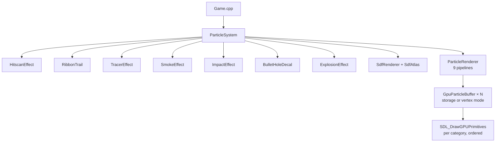

# Particles & VFX

CPU-simulated particles rendered through SDL3 GPU instanced/strip draws. **No compute shaders** — the system uses CPU pools + GPU storage/vertex buffers per effect category. SDF text uses the same atlas as the HUD.

Last verified against source: branch `core/collisions+wallrun` (2026-05-16).

> Despite the name, `GpuParticleBuffer` is a thin CPU→GPU transfer-buffer wrapper, not a compute backend.

> **Status:** particles tick correctly each frame, but the **new renderer never invokes the particle render path** — `Game.cpp:201` has `// TODO(renderer-migration): renderer->setParticleSystem(&particleSystem);` commented out. Effects are dead-end CPU work today (see [graphics.md §9](graphics.md#9-particles)).

---

## 1. Architecture



Each effect class has its own CPU pool, GPU buffer, and pipeline. `ParticleRenderer::drawAll` issues 9 ordered draw calls with the correct blend state per category.

---

## 2. GpuParticleBuffer

CPU→GPU transfer-buffer wrapper, two modes:

| Mode | GPU usage | Shader reads via |
|---|---|---|
| **Storage** | `SDL_GPU_BUFFERUSAGE_GRAPHICS_STORAGE_READ` | per-particle struct via `gl_InstanceIndex` |
| **Vertex** | `SDL_GPU_BUFFERUSAGE_VERTEX` | pre-expanded triangle stream |

Storage is used for billboards, tracers, hitscan beams, smoke, decals, SDF glyphs. Vertex is used for ribbons and lightning arcs (pre-expanded camera-facing strips).

`cycle=true` on transfer-buffer map so the GPU can still read the previous frame while the CPU writes the next.

---

## 3. Particle pool

`ParticlePool<T, MaxN>` (`src/client/particles/ParticlePool.hpp`):

- Fixed `std::array` of `MaxN` particles
- O(1) swap-remove via `kill(i)` — **order not preserved**
- Backward iteration in `update(fn)` so callers can safely `kill()` from the lambda

### Pool sizes (`ParticleRenderer::init`)

| Effect | Capacity |
|---|---|
| Billboards (impact, etc.) | 4096 |
| Tracers | 512 (TracerEffect uses pool of 512) |
| Hitscan beams | `k_maxBeams = 4` (slot-stealing on overflow) |
| Smoke | 1024 |
| Decals | 512 |
| SDF world text | 4096 glyphs |
| SDF HUD text | 4096 glyphs |
| Ribbon vertex buffer | 24576 vertices |
| Lightning arc vertex buffer | 2048 vertices |

### Lifetimes (per effect)

| Effect | Lifetime |
|---|---|
| Impact particles | 0.25–0.45 s |
| Shockwave ring | 0.3 s |
| Smoke | 3–5 s |
| Tracer fade | 0.15 s |
| Hitscan beam | 0.22 s |
| Bullet-hole decals | 15 s linear fade — **never killed**, drawn at α=0 forever |

---

## 4. Effect catalogue

### Hitscan beam (`HitscanEffect.cpp`)

Cinematic energy beam:

```mermaid
flowchart LR
  Spawn[spawn] --> Spine[cubic Bezier spine, 32 segments]
  Spine --> Warp[4-octave domain-warped fBm displacement<br/>sin(t·π) pinning envelope]
  Warp --> Layers[3 concentric ribbon layers:<br/>outer bloom, energy channel, white-hot core]
  Layers --> Branches[2–5 forked branches re-randomised every 45 ms]
  Branches --> Strokes[3 scheduled return strokes at 60/120/180 ms<br/>re-randomise the path]
  Strokes --> Draw[render as TRIANGLESTRIP]
```

Beam-slot stealing when 4 beams in flight.

### Ribbon (`RibbonTrail.cpp`)

ECS-driven via `RibbonEmitter` (32-node ring per entity, rockets/slow projectiles). Per-frame:

1. Age all nodes, drop expired
2. Optionally record a new node
3. Re-order nodes by age
4. Emit 6 vertices per consecutive pair into a flat camera-facing strip

Premul alpha tip→tail (α=0 at tail).

### Tracer (`TracerEffect.cpp`)

Oriented capsule streak — two attachment modes:

- `attach(entity)` ties to a projectile; updates tip/tail from `Position + Velocity` each frame
- `spawnFree()` one-shot streak with finite lifetime (used for client-predicted bullet tracers from the local player's gun)

`entityToIdx_` map rebuilt after `kill()` — O(N·M) on burst kill (see *potential-issues*).

### Smoke (`SmokeEffect.cpp`)

Spawned from `ParticleEmitterTag{Smoke|Fire|Steam}` ECS components. Drifts upward, fades alpha, expands. Used by `FireField` (sync'd via `Position + ParticleEmitterTag{Fire}` emplace each frame in `Game.cpp:1488-1494`).

### Impact (`ImpactEffect.cpp`)

Per-surface burst sprites + shockwave ring on bullet hit. Spawned via `dispatcher.enqueue(ProjectileImpactEvent)` → `ParticleSystem::onImpact`.

### Bullet-hole decal (`BulletHoleDecal.cpp`)

Quad oriented to surface normal. Fade `opacity -= dt/15` for 15 s — **never killed**, just rendered with α=0 after fade.

### Explosion (`ExplosionEffect.cpp`)

Shockwave ring (0.3 s) + sprites. Spawned from `dispatcher.enqueue(ExplosionEvent)` → both `ParticleSystem::onExplosion` and `SfxSystem::onExplosion`.

### Lightning arc

Vertex-mode pre-expanded triangle stream. Used as a child of HitscanEffect for forks/branches.

---

## 5. SDF text (`particles/sdf/`)

Despite living under `particles/`, this is **font rendering** infrastructure, not effects.

```mermaid
flowchart LR
  Sys[OS font scan:<br/>Adwaita/DejaVu/Noto/Liberation<br/>Arial/SFNS · segoeui] --> stbtt[stbtt_GetCodepointSDF<br/>codepoints 32–126]
  stbtt --> Atlas[1024×1024 R8_UNORM atlas<br/>shelf packer, on-edge 128, spread 12]
  Atlas --> Reg[GlyphInfo: uvMin/uvMax, bearing, advance, ...]
  Reg --> Sdf[SdfRenderer queues per-frame:<br/>world-space (depth-tested) + screen-space glyph quads]
  Sdf --> Shared[atlas shared with HUD<br/>Hud::init takes SdfAtlas ref]
```

Atlas only bakes **ASCII 32–126** — no UTF-8, no accented chars, no emoji. Names with non-Latin chars render as gaps.

---

## 6. Event wiring

```mermaid
flowchart LR
  GameCode[Game.cpp gameplay] -- dispatcher.enqueue --> D[entt::dispatcher]
  D --> WF[WeaponFiredEvent → SfxSystem only<br/>NOT ParticleSystem<br/>(client wants explicit per-weapon control)]
  D --> PI[ProjectileImpactEvent → ParticleSystem::onImpact]
  D --> EX[ExplosionEvent → ParticleSystem::onExplosion<br/>+ SfxSystem::onExplosion]
  Server[Client::onRawParticleEvent] --> Replicated["server-replicated VFX:<br/>NetParticleEvent → spawnX(...)"]
  Replicated --> Effects[ParticleSystem.spawnX]
  Direct["Game.cpp local prediction:<br/>particleSystem.spawnX directly"] --> Effects
```

`dispatcher.update()` is called once per frame (`Game.cpp:1481`) to drain queued events into the sinks.

Server-replicated particle events (`NetParticleEvent` — see [networking.md](networking.md#3-packet-types)) cover VFX for **remote players' shots** so they look the same everywhere.

---

## 7. ECS components consumed

| Component | Role |
|---|---|
| `RibbonEmitter` | per-entity ring of 32 ribbon nodes |
| `TracerEmitter` | per-entity tracer attachment |
| `ParticleEmitterTag` | `{Smoke\|Fire\|Steam, rate, radius}` |
| `BeamState` | replicated continuous beam |
| `FireField` | replicated; drives smoke/fire emitters |

---

## 8. Authoring a new effect

```text
1. Add a class with update(dt, ...) and spawn(...) + data()/count()
2. Add a CPU pool member
3. Add a GpuParticleBuffer + Pipeline + shaders in ParticleRenderer::buildPipelines
4. Add uploadX/render calls in uploadToGpu + drawAll
```

No data-driven authoring — every effect is C++.

---

## 9. Configuration & toggles

Debug UI (F2) Particle System panel exposes per-effect counters and spawn buttons (`src/client/debug/DebugUI.cpp`).

No serialized particle config.

---

## 10. Key files

| File | Role |
|---|---|
| `src/client/particles/ParticleSystem.{cpp,hpp}` | Top-level driver |
| `src/client/particles/ParticleRenderer.{cpp,hpp}` | 9 pipelines + drawAll |
| `src/client/particles/GpuParticleBuffer.{cpp,hpp}` | CPU→GPU transfer wrapper |
| `src/client/particles/ParticlePool.hpp` | Fixed-array swap-remove pool |
| `src/client/particles/ParticleTypes.hpp`, `ParticleEvents.hpp` | Type defs, dispatcher events |
| `src/client/particles/effects/HitscanEffect.cpp` | Energy beam |
| `src/client/particles/effects/RibbonTrail.cpp` | Rocket trails |
| `src/client/particles/effects/TracerEffect.cpp` | Bullet streaks |
| `src/client/particles/effects/SmokeEffect.cpp` | Drifting smoke |
| `src/client/particles/effects/ImpactEffect.cpp` | Surface bursts |
| `src/client/particles/effects/BulletHoleDecal.cpp` | Quad decals (never killed) |
| `src/client/particles/effects/ExplosionEffect.cpp` | Shockwave + sprites |
| `src/client/particles/sdf/SdfAtlas.cpp` | Font glyph baking |
| `src/client/particles/sdf/SdfRenderer.cpp` | World + screen glyph queues |
| `src/ecs/components/BeamState.hpp`, `RibbonEmitter.hpp`, `TracerEmitter.hpp`, `ParticleEmitterTag.hpp` | ECS components |

See [potential-issues.md](potential-issues.md#particles--vfx).
