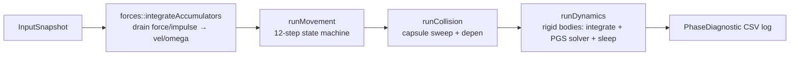
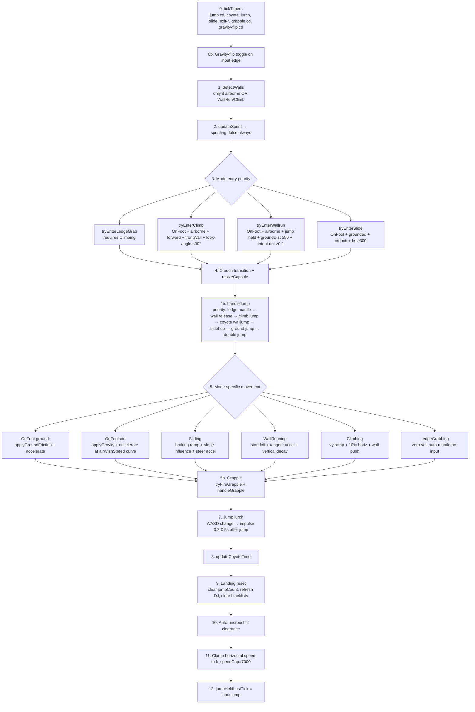
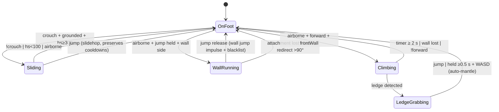
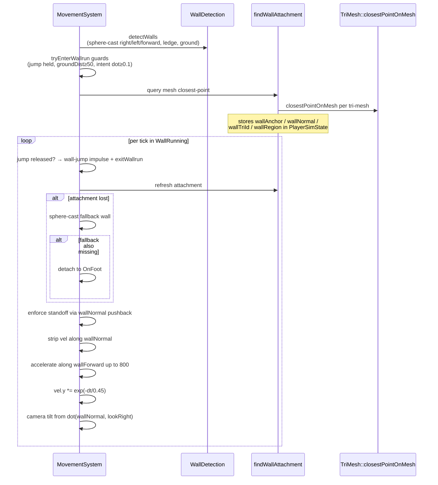
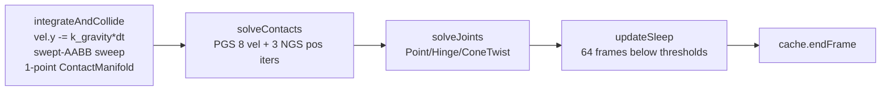

# Physics — movement, dynamics, forces

Player movement is a hand-rolled **Titanfall-style state machine** with a Quake-inspired pmove order: friction → accelerate → integrate → collide. The same code runs on client (for prediction) and server (authoritative).

Last verified against source: branch `core/collisions+wallrun` (2026-05-16).

> Physics shares a tick with collisions but is conceptually separate. See [collisions.md](collisions.md) for the capsule sweep / depen / TriMesh pipeline.

---

## 1. Units & coordinate frame

- **Quake units** (1 unit ≈ 1 inch). All distances in `PhysicsConstants.hpp`, `TitanfallConstants.hpp` are Quake units.
- **Y-up.** Gravity is `-Y` by default; flipped gravity inverts it.
- **Time**: SI seconds. Fixed `dt = 1/128 s`.

---

## 2. Pipeline



`runMovement` runs **before** `runCollision`. Movement consumes the previous tick's `grounded` flag and produces a velocity; Collision then sweeps position with that velocity and refreshes `grounded`/`groundNormal`. This is canonical Quake pmove ordering.

`runDynamics` only affects entities with `RigidBody` (ragdoll bones, dropped weapons, dynamic props). **Players are kinematic** — handled by Movement+Collision, not Dynamics.

---

## 3. Per-tick state machine (`runMovement`)

For every player entity (excludes dead via `RespawnTimer`):



State transitions (`MoveMode`):



---

## 4. Movement math (`Movement.cpp`)

Pure value-in/value-out helpers, no ECS:

| Function | Formula |
|---|---|
| `applyGravity(vel, dt, flipped)` | `vel.y += (flipped ? +1 : -1) * k_gravity * dt` |
| `applyGroundFriction(vel, dt)` | Quake: `drop = max(speed, k_stopSpeed) * k_friction * dt`; `vel.xz *= max(0, speed-drop) / speed` |
| `accelerate(vel, wishDir, wishSpeed, accel, dt)` | `addSpeed = wishSpeed - dot(vel, wishDir)`; if >0, `vel += wishDir * min(accel*dt*wishSpeed, addSpeed)`. **Does NOT cap total speed** — preserves strafe-jump momentum |
| `airWishSpeedForHorizSpeed(hs)` | Power curve: `120 + (30-120) * pow(hs/250, 0.4)`; floor 30 at `hs ≥ 250` |
| `clipVelocity(vel, n, overbounce)` | `vel - n * dot(vel, n) * overbounce` |
| `computeWishDir(yaw, fwd, back, left, right)` | Builds local move vector, projects to world via yaw rotation |

---

## 5. Constants

### `PhysicsConstants.hpp` (engine tunables)

| Constant | Value | Meaning |
|---|---|---|
| `k_gravity` | 1000 u/s² | Standard down acceleration |
| `k_jumpSpeed` | 330 u/s | Initial vertical jump speed |
| `k_groundAccel` | 10 | |
| `k_airAccel` | 700 | Much higher than Quake — Titanfall parity |
| `k_airMaxSpeed` / `k_airMaxWishLowSpeed` | 30 / 120 | wish-speed floor (at speed) / ceiling (stationary) |
| `k_airWishCurveTop` | 250 | speed where curve plateaus |
| `k_airWishCurveExponent` | 0.4 | <1 → sharp early drop |
| `k_friction` | 7.5 | |
| `k_stopSpeed` | 150 | Quake "minimum control" trick |
| `k_overbounceWall` / `k_overbounceFloor` | 1.001 / 1.0 | |
| `k_stepHeight` | 18 | Auto-step max |
| `k_floorAngleCos` | 0.7 | ≈45.6° walkable slope |
| `k_groundSnapDistance` | 8 | Ground-probe extension |
| `k_emergencyUnstickRadius` | 64 | |
| `k_maxDepenPasses` | 6 | |
| `k_gravityFlipCooldown` | 0.5 s | |
| `k_enableSubstepping` | true | |
| `k_substepSafetyRatio` | 0.5 | |
| `k_maxSubsteps` | 8 | |

### `TitanfallConstants.hpp` (gameplay tunables, `tms::` namespace)

| Group | Constants (excerpt) |
|---|---|
| **Ground speeds** | `k_walkSpeed=550`, `k_crouchSpeed=350` |
| **Jump** | `k_jumpSpeed=330` (mirrors physics), `k_doubleJumpSpeed=300`, `k_slidehopJumpSpeed=250`, `k_doubleJumpCooldown=0.10`, `k_doubleJumpHorizBoost=400`, `k_coyoteTime=0.15` |
| **Jump lurch** | `k_jumpLurchStrength=5.0`, `k_jumpLurchMax=400`, `k_jumpLurchGraceMin/Max=0.2/0.5` |
| **Slide** | `k_slideMinStartSpeed=300`, `k_slideBoostMin/Max=180/380`, `k_slideBoostCooldown=1.5`, `k_slideBrakingDecelMin/Max=200/400`, `k_slideFloorInfluenceForce=400` |
| **Wallrun** | `k_wallrunMaxSpeed=800`, `k_wallrunAccel=500`, `k_wallrunVerticalDecayTau=0.45`, `k_wallrunEntryVerticalImpulse=220`, `k_wallJumpUpForce=320`, `k_wallJumpSideForce=350`, `k_wallrunCameraTilt=7.5°` |
| **Climb** | `k_climbMaxSpeed=280`, `k_climbKickoffDuration=2.0`, `k_climbMaxWallLookAngle=30°`, `k_climbJumpUpForce=320` |
| **Ledge** | `k_ledgeMinHoldTime=0.5`, `k_ledgeJumpUpForce=350`, `k_ledgeJumpBackForce=120` |
| **Grapple** | `k_grappleMaxRange=4000`, `k_grapplePullSpeed=4000`, `k_grappleMaxDuration=5.0`, `k_grappleCooldown=5.0`, `k_grapplePerchFeetOffset=50` |
| **Player dimensions** | `k_playerCapsuleRadius=16`, `k_standingHalfHeight=36`, `k_crouchingHalfHeight=22` |
| **Speed cap** | `k_speedCap=7000` |

### Dead / unused constants

`k_wallrunKickoffDuration=1.75`, `k_wallrunDetachThreshold=-0.26`, `k_wallrunGripTime=1.0`, `k_wallrunGravityRampTime=2.0` are **declared but never read**. The wallrun no longer uses grip/ramp; vertical decay is `exp(-dt/0.45)`. See *potential-issues*.

---

## 6. Wallrunning subsystem



The wall-attachment data (`wallAnchor`, `wallNormal`, `wallForward`) is stored in `PlayerSimState` and refreshed each tick. `wallTriId` and `wallRegion` are **written but never read** — Phase D adjacency walking via `WorldTriMesh::edgeNeighbor` is not yet wired.

The "entry mechanism uses sphere-cast `WallDetection`, sustain uses `closestPointOnMesh`" split means wallrun entry can fail on a tri-mesh wall that's near but slightly beyond `k_wallrunCheckDist + sphereRadius`. See *potential-issues*.

`findWallAttachment` **only iterates `world.triMeshes`** — boxes/brushes/cylinders/spheres are silently ignored. On `testWorld()` (all boxes), it always returns `{found=false}` and the sphere-cast fallback carries everything.

---

## 7. Dynamics (rigid bodies)

`DynamicsSystem` (`src/ecs/systems/DynamicsSystem.cpp`) runs for entities with `RigidBody`:



**Gravity is hardcoded `-Y` here** — does NOT honor `gravityFlipped` (`DynamicsSystem.cpp:45`). Comment says intentional.

### Joints

- `PointJoint` (3-DOF anchor lock with warm-start)
- `HingeJoint` (1-DOF + optional motor + angle limits) — uses placeholder unit effective mass for angular DOFs (`Joints.cpp:235`)
- `ConeTwistJoint` (full swing-twist Stan Melax decomposition + Baumgarte limits)
- `Joint6DOF` (declared, no solver yet)

Used by `Ragdoll` (15 bones, 14 joints — 6× ConeTwist, 4× Hinge, 4× Point).

### Solver (`Solver.cpp`)

Sequential-Impulse (Box2D-style):

| Knob | Default |
|---|---|
| `positionIterations` | 3 |
| `velocityIterations` | 8 |
| `baumgarteScale` | 0.2 |
| `linearSlop` | 0.005 |
| `maxLinearCorrection` | 0.2 |
| `defaultFriction` | 0.7 |
| `defaultRestitution` | 0.0 |
| `velThreshForRestitution` | 1.0 |

Warm-starts via `ContactCache` (cached `normalImpulse` + `tangentImpulse[2]` per pair-point feature).

### Sleep

| Knob | Default |
|---|---|
| `linearThresh` | 0.5 |
| `angularThresh` | 0.1 |
| `framesToSleep` | 64 (~0.5 s @ 128 Hz) |

Wake propagates via `wakeIslandOf` — BFS through ContactCache adjacency.

---

## 8. Forces API (`src/ecs/physics/Forces.hpp`)

Mass-aware accumulators. Gameplay code calls these instead of mutating `Velocity` directly:

| API | Effect |
|---|---|
| `applyImpulse(reg, e, J)` | RigidBody: `impulseAccum += J`. Else: `vel += J` (unit-mass kinematic) |
| `applyForce(reg, e, F)` | RigidBody only: `forceAccum += F`. **No-op without RigidBody** |
| `applyImpulseAtPoint(reg, e, J, worldPoint)` | Linear + angular `r×J` |
| `applyForceAtPoint` / `applyTorque` | Analogous |
| `integrateAccumulators(reg, dt)` | Drain — runs at top of `runMovement` |

Used by `ExplosionSystem::runExplosion` for radial knockback.

---

## 9. Determinism

| Mechanism | Detail |
|---|---|
| **Shared compilation** | `Movement.cpp`, `MovementSystem.cpp`, `CollisionSystem.cpp`, `PhysicsConstants.hpp`, `TitanfallConstants.hpp` compiled identically on client + server |
| **Fixed dt** | `1/128 s` on both sides |
| **Input replay** | `InputRingBuffer` (256 slots) for reconciliation |
| **Stable iteration order** | `solveContacts` sorts manifolds by canonical pair key; `solveJoints` sorts by entity id |
| **Parallel-safe kernels** | Each entity's kernel reads only its own components + read-only `WorldGeometry` |
| **No fast-math** | No `-ffast-math`/strict-fp flags set; trusts IEEE 754 + identical compiler flags |

`DeterminismHash::hashPhysicsState` (`DeterminismHash.cpp`) computes FNV-1a 64-bit over `Position + Velocity + Orientation + AngularVelocity + invMass + isAsleep + sleepCounter` for every entity, sorted by id. Used by CI golden tests + client/server divergence detection. Force/impulse accumulators are excluded (zeroed every tick).

**Known drift**: `PlayerSimState` is **server-only**, so reconciliation replay uses whatever timer values the client locally accumulated (coyote, jump cooldown, slide fatigue). Position/velocity converge via replay; "feel" cases at the edge of coyote windows can desync.

---

## 10. Phase diagnostic instrumentation

`PhaseDiagnostic` (`src/ecs/physics/PhaseDiagnostic.cpp`) is **always-on on the server** (`ServerGame.cpp:94`):

```
phase-diag-YYYYMMDD-HHMMSS.csv     — per-player per-tick state
depen-trace-YYYYMMDD-HHMMSS.csv    — back-face overlap details on suspicious depen
```

`PlayerFrame` captures `posBefore`/`posAfterDepen`/`posAfter`, `velBefore`/`velAfter`, `lastHitNormal`, `depenPushDistance`, `bumpHits`, plus a `PhaseFlag` bitfield (Grounded / WallRunning / Sliding / Climbing / LedgeGrabbing / GrappleActive / DoubleJumped / GravityFlipped / DepenCancelled / DeepPenetration / BumpExhausted / **SuspectedPhase**).

Auto-flags `SuspectedPhase` when `actualΔ > 2·expectedΔ + 5u`.

Wait-free no-op when disabled. The CLI flag to disable it is a TODO (`ServerGame.cpp:93`).

---

## 11. Key files

| File | Role |
|---|---|
| `src/ecs/physics/PhysicsConstants.hpp` | Engine tunables |
| `src/ecs/physics/TitanfallConstants.hpp` | Gameplay tunables (`tms::`) |
| `src/ecs/physics/Movement.cpp` | Pure math primitives |
| `src/ecs/systems/MovementSystem.cpp` | State machine + per-entity tick |
| `src/ecs/physics/Forces.cpp` | Mass-aware accumulators |
| `src/ecs/systems/DynamicsSystem.cpp` | Rigid-body integration |
| `src/ecs/physics/Solver.cpp` | Sequential-Impulse PGS solver |
| `src/ecs/physics/Joints.cpp` | Point/Hinge/ConeTwist constraints |
| `src/ecs/physics/Sleep.cpp` | Sleep/wake bookkeeping |
| `src/ecs/physics/Inertia.hpp` | Analytical inverse inertia tensors |
| `src/ecs/physics/WallDetection.cpp` | Sphere-cast wallrun/climb/ledge probes |
| `src/ecs/physics/PhaseDiagnostic.cpp` | CSV instrumentation |
| `src/ecs/physics/DeterminismHash.cpp` | Cross-side parity hash |

See [collisions.md](collisions.md) for the sweep / depen / closest-point pipeline.
