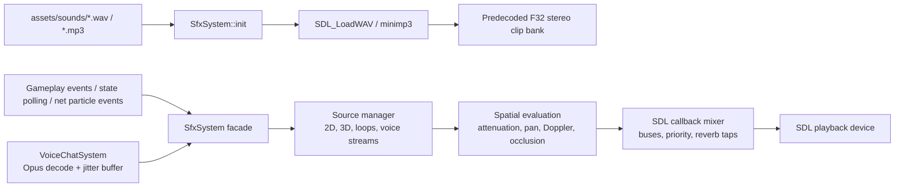

# SFX, Voice, And Spatial Audio

SDL3 audio directly (no SDL_mixer, no OpenAL). The client now owns one playback
device and one custom mixer path, while `SfxSystem` remains the game-facing
facade for UI sounds, weapon sounds, world sounds, loops, and voice playback.

Last verified against source: branch `codex/text-voice-chat-audio` (2026-05-18).

---

## 1. Architecture



`SfxSystem` owns:

- clip loading and preconversion into mixer-ready float PCM
- a bounded 64-source pool with priority stealing and virtualization
- category volumes and master gain
- one SDL playback stream fed by the custom mixer
- positional source handles for loops and moving sounds
- per-speaker voice PCM queues
- listener state, occlusion checks, simple reflection/reverb state

The old per-shot `SDL_AudioStream` allocation path is gone.

---

## 2. Public Facade

Gameplay code should call the facade, not the mixer internals:

| API | Use |
|---|---|
| `play(SfxId, gain)` / `play2D(...)` | UI, local-only, or player-space one-shots |
| `play3D(id, position, velocity, gain, priority)` | World one-shots such as remote fire, impacts, explosions, footsteps |
| `startLoop(...)` | Persistent sounds such as beams or charge loops |
| `updateSource(handle, position, velocity, gain)` | Move an active loop/source |
| `stopSource(handle)` / `stop(id)` | Stop one handle or all sources for a clip |
| `setListener(listener)` | Update camera/player position, orientation, and velocity |
| `submitVoiceFrame(speaker, seq, pcm, position, velocity)` | Feed decoded remote voice into positional playback |

`play()` is kept for older callers and currently forwards to the 2D path.

---

## 3. Mixer And Buses

The audio callback mixes into 48 kHz stereo float. Clips are predecoded and
converted before playback so the hot path does not allocate streams per sound.

```text
effective_gain = master_gain * category_gain * clip_gain * caller_gain * spatial_gain
```

Categories include weapons, impacts, player feedback, footsteps, voice, and UI.
Cooldowns still exist for spammy clips such as rifle fire and healing ticks.

When the source pool is full, low-priority or least-important sources are stolen
before high-priority gameplay cues. Voice queues are bounded per speaker to avoid
unbounded memory growth during stalls.

---

## 4. Spatial Model

The v1 spatial path is lightweight but real:

| Feature | Behavior |
|---|---|
| Attenuation | Full gain within about 450 units, fades to silence by about 3500 units |
| Panning | Equal-power stereo pan from listener forward/up basis |
| Doppler | Relative source/listener velocity changes playback step, clamped for stability |
| Occlusion | Raycast from listener to source against active physics world |
| Low-pass | Occluded sources get softened in the mixer |
| Reverb/reflections | Simple delay taps and reverb send, stronger for occluded/distant sources |

Future room/portal metadata can replace the occlusion/reverb evaluator without
changing gameplay callers, because callers only provide source/listener state.

---

## 5. Voice Chat Path

Voice is push-to-talk on `V` and is disabled while text chat or text-input UI is
active. The local client captures SDL recording audio, gates very quiet frames,
encodes Opus at 48 kHz mono / 20 ms, and sends `VOICE_FRAME` packets on the
unreliable sequenced voice channel.

Receive path:

```text
server VOICE_FRAME
  -> VoiceChatSystem::enqueueFrame
  -> per-speaker VoiceJitterBuffer
  -> Opus decoder / packet-loss concealment
  -> SfxSystem::submitVoiceFrame
  -> positional voice source at replicated speaker transform
```

The server proximity-routes voice from authoritative positions: nearby listeners
receive the frame, clients outside max voice range do not. The client also keeps
short-lived speaking indicators for the HUD.

---

## 6. Gameplay SFX

### Local feedback

Local weapon fire still plays predicted in player space for responsiveness.
Damage, armor break, kill confirm, death, respawn, and healing cues are detected
from local state deltas in `SfxSystem::update`.

### Authoritative remote sounds

Remote fire, impacts, explosions, grenade throws, and beams are driven from
replicated gameplay/particle events. Local duplicate echoes are skipped where the
local prediction already played the sound.

### Loops

Beam/charge style sounds use source handles:

```text
startLoop -> updateSource each frame -> stopSource
```

This keeps moving world loops positioned correctly and avoids pretending a
one-shot clip is a loop.

### Footsteps

Footsteps are animation-driven. `Game` tracks locomotion clip phase per animated
entity and emits footstep one-shots when left/right marker phases are crossed.
The event is positioned at the animated entity with a small side offset and uses
light/heavy placeholder clips depending on movement state.

---

## 7. Assets And Placeholders

`assets/sounds/` still contains mostly placeholder WAV/MP3 files. Missing clips
are synthesized at startup for build stability, including:

- `FootstepLight`
- `FootstepHeavy`
- `GrenadeThrow`
- `VoiceStart`
- `VoiceStop`

Final content can replace these mappings without changing gameplay code.

---

## 8. Key Files

| File | Role |
|---|---|
| `src/client/sfx/SfxSystem.hpp/.cpp` | Facade, clip bank, mixer, source manager, event sinks, state polling |
| `src/client/sfx/AudioMath.hpp/.cpp` | Attenuation, panning, Doppler, occlusion/reverb parameters |
| `src/client/sfx/SfxTypes.hpp` | Clip IDs, categories, clip metadata |
| `src/client/voice/VoiceCapture.hpp/.cpp` | SDL recording, PTT, Opus encode |
| `src/client/voice/VoiceChatSystem.hpp/.cpp` | Remote speaker jitter/decode/spatial voice submission |
| `src/client/voice/VoiceJitterBuffer.hpp/.cpp` | Bounded unreliable frame ordering and gap handling |
| `src/network/VoiceProtocol.hpp/.cpp` | Bounded voice packet encode/decode |
| `tests/audio_math_tests.cpp` | Spatial math unit coverage |
| `tests/voice_jitter_tests.cpp` | Jitter buffer ordering/drop coverage |

---

## 9. Limitations

- This is not HRTF audio; stereo pan is the v1 spatial renderer.
- Corridor/room acoustics are practical raycast + reverb approximations, not an
  authored room/portal graph yet.
- Voice QA still needs real multi-client microphone testing on different
  machines and networks.
- Most final production sound assets have not landed yet.
