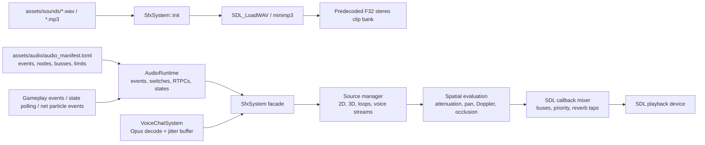

# SFX, Voice, And Spatial Audio

SDL3 audio directly (no SDL_mixer, no OpenAL). The client now owns one playback
device and one custom mixer path, while `SfxSystem` remains the game-facing
facade for UI sounds, weapon sounds, world sounds, loops, and voice playback.

Last verified against source: branch `codex/text-voice-chat-audio` (2026-05-18).

---

## 1. Architecture



`SfxSystem` owns:

- clip loading and preconversion into mixer-ready float PCM
- a bounded 64-source pool with priority stealing and virtualization
- manifest-driven events, nodes, busses, limits, RTPCs, switches, and states
- category volumes, bus volumes, and master gain
- one SDL playback stream fed by the custom mixer
- positional source handles for loops and moving sounds
- per-speaker voice PCM queues
- listener state, occlusion checks, simple reflection/reverb state

The old per-shot `SDL_AudioStream` allocation path is gone.

---

## 2. Public Facade

Gameplay code should call the facade, not the mixer internals:

| API | Use |
|---|---|
| `play(SfxId, gain)` / `play2D(...)` | UI, local-only, or player-space one-shots |
| `play3D(id, position, velocity, gain, priority)` | World one-shots such as remote fire, impacts, explosions, footsteps |
| `startLoop(...)` | Persistent sounds such as beams or charge loops |
| `updateSource(handle, position, velocity, gain)` | Move an active loop/source |
| `stopSource(handle)` / `stop(id)` | Stop one handle or all sources for a clip |
| `setListener(listener)` | Update camera/player position, orientation, and velocity |
| `postAudioEvent(name, object, gain)` | Resolve a semantic manifest event into one or more mixer sources |
| `setAudioObjectTransform(object, pos, vel)` | Update a Wwise-style emitter/game object |
| `setAudioRtpc` / `setAudioSwitch` / `setAudioState` | Drive data-defined variation and mix behavior |
| `setAudioBusVolume` / `reloadAudioManifest` | Runtime mix tuning and debug hot reload |
| `submitVoiceFrame(speaker, seq, pcm, position, velocity)` | Feed decoded remote voice into positional playback |

`play()` is kept for older callers, but gameplay-facing code should prefer
semantic events such as `weapon.rifle.fire`, `impact.flesh`, and `footstep`.

---

## 3. Wwise-Lite Runtime

`AudioRuntime` is the authoring/runtime separation layer. It loads
`assets/audio/audio_manifest.toml`; if the file is unavailable, it falls back to
an equivalent built-in graph so the game still has sound.

Manifest primitives currently supported:

| Primitive | Status |
|---|---|
| Stable IDs | FNV-1a IDs generated from manifest names |
| Events | Action lists with `play`, `stop`, `set_rtpc`, `set_switch`, `set_state`, `set_bus_volume` |
| Game objects | Per-object transform, velocity, RTPCs, and switches |
| Nodes | `sound`, `random`, `sequence`, `switch`, and `blend` |
| RTPCs | Float values used by blend nodes, e.g. footstep intensity |
| Switches/states | Object switch groups and global state groups drive switch nodes |
| Busses | Parented gain routing, priority offsets, and max voice counts |
| Clip metadata | Gain, priority, cooldown, loop, spatial flag, max instances, attenuation distances |
| Hot reload | `SfxSystem::reloadAudioManifest()` reloads the TOML graph |
| Stats | `AudioRuntimeStats` and `SfxRuntimeStats` expose event/source counters |

---

## 4. Mixer And Buses

The audio callback mixes into 48 kHz stereo float. Clips are predecoded and
converted before playback so the hot path does not allocate streams per sound.

```text
effective_gain = master_gain * category_gain * bus_gain * clip_gain * caller_gain * spatial_gain
```

Categories include weapons, impacts, player feedback, footsteps, voice, and UI.
Cooldowns still exist for spammy clips such as rifle fire and healing ticks.

When clip, bus, or global source limits are reached, lower-priority sounds are
stolen before high-priority gameplay cues. Voice queues are bounded per speaker
to avoid unbounded memory growth during stalls.

---

## 5. Spatial Model

The v1 spatial path is lightweight but real:

| Feature | Behavior |
|---|---|
| Attenuation | Manifest-tunable full-gain/max-distance values, defaulting to about 450/3500 units |
| Panning | Equal-power stereo pan from listener forward/up basis |
| Doppler | Relative source/listener velocity changes playback step, clamped for stability |
| Occlusion | Raycast from listener to source against active physics world |
| Low-pass | Occluded sources get softened in the mixer |
| Reverb/reflections | Simple delay taps and reverb send, stronger for occluded/distant sources |

Future room/portal metadata can replace the occlusion/reverb evaluator without
changing gameplay callers, because callers only provide source/listener state.

---

## 6. Voice Chat Path

Voice is push-to-talk on `V` and is disabled while text chat or text-input UI is
active. The local client captures SDL recording audio, gates very quiet frames,
encodes Opus at 48 kHz mono / 20 ms, and sends `VOICE_FRAME` packets on the
unreliable sequenced voice channel.

Receive path:

```text
server VOICE_FRAME
  -> VoiceChatSystem::enqueueFrame
  -> per-speaker VoiceJitterBuffer
  -> Opus decoder / packet-loss concealment
  -> SfxSystem::submitVoiceFrame
  -> positional voice source at replicated speaker transform
```

The server proximity-routes voice from authoritative positions: nearby listeners
receive the frame, clients outside max voice range do not. The client also keeps
short-lived speaking indicators for the HUD.

---

## 7. Gameplay SFX

### Local feedback

Local weapon fire still plays predicted in player space for responsiveness, but
the actual cue is now a semantic manifest event.
Damage, armor break, kill confirm, death, respawn, and healing cues are detected
from local state deltas in `SfxSystem::update`.

### Authoritative remote sounds

Remote fire, impacts, explosions, grenade throws, and beams are driven from
replicated gameplay/particle events. Local duplicate echoes are skipped where the
local prediction already played the sound.

### Loops

Beam/charge style sounds use source handles:

```text
startLoop -> updateSource each frame -> stopSource
```

This keeps moving world loops positioned correctly and avoids pretending a
one-shot clip is a loop.

### Footsteps

Footsteps are animation-driven. `Game` tracks locomotion clip phase per animated
entity and posts a `footstep` event when left/right marker phases are crossed.
Movement intensity is sent as an RTPC so the manifest can blend light/heavy
footsteps or later switch by surface material.

---

## 8. Assets And Placeholders

`assets/audio/audio_manifest.toml` is the data-driven audio graph. `assets/sounds/`
still contains mostly placeholder WAV/MP3 files. Missing clips are synthesized at
startup for build stability, including:

- `FootstepLight`
- `FootstepHeavy`
- `GrenadeThrow`
- `VoiceStart`
- `VoiceStop`

Final content can replace these mappings without changing gameplay code.

---

## 9. Key Files

| File | Role |
|---|---|
| `src/client/sfx/SfxSystem.hpp/.cpp` | Facade, clip bank, mixer, source manager, event sinks, state polling |
| `src/client/sfx/AudioRuntime.hpp/.cpp` | Manifest loader, event/node resolver, object RTPC/switch/state runtime |
| `src/client/sfx/AudioMath.hpp/.cpp` | Attenuation, panning, Doppler, occlusion/reverb parameters |
| `src/client/sfx/SfxTypes.hpp` | Clip IDs, categories, clip metadata |
| `assets/audio/audio_manifest.toml` | Wwise-lite event/node/bus/clip authoring data |
| `src/client/voice/VoiceCapture.hpp/.cpp` | SDL recording, PTT, Opus encode |
| `src/client/voice/VoiceChatSystem.hpp/.cpp` | Remote speaker jitter/decode/spatial voice submission |
| `src/client/voice/VoiceJitterBuffer.hpp/.cpp` | Bounded unreliable frame ordering and gap handling |
| `src/network/VoiceProtocol.hpp/.cpp` | Bounded voice packet encode/decode |
| `tests/audio_math_tests.cpp` | Spatial math unit coverage |
| `tests/audio_runtime_tests.cpp` | Manifest, event, node, switch/state/RTPC coverage |
| `tests/voice_jitter_tests.cpp` | Jitter buffer ordering/drop coverage |

---

## 10. Limitations

- This is not HRTF audio; stereo pan is the v1 spatial renderer.
- Corridor/room acoustics are practical raycast + reverb approximations, not an
  authored room/portal graph yet.
- There is no visual authoring editor; authoring is TOML plus runtime hot reload.
- Interactive music and dialogue trees are not built yet, but the event/node
  runtime can host them later.
- Voice QA still needs real multi-client microphone testing on different
  machines and networks.
- Most final production sound assets have not landed yet.
