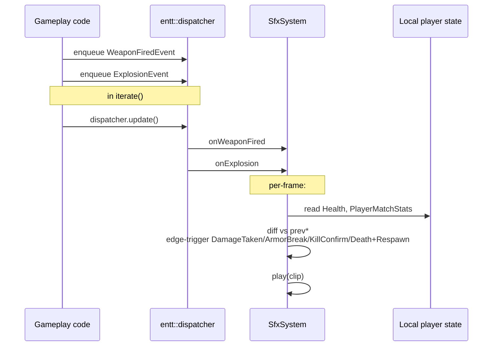

# SFX

SDL3 audio directly (no SDL_mixer, no OpenAL). MP3 decode via vendored `minimp3`, WAV via `SDL_LoadWAV`. Engine does its own mixing through a 32-voice pool. Fed by both `entt::dispatcher` events and per-frame state-delta polling.

Last verified against source: branch `core/collisions+wallrun` (2026-05-16).

---

## 1. Architecture

```mermaid
flowchart LR
  Assets[assets/sounds/*.wav · *.mp3] --> Init[SfxSystem::init]
  Init --> Decode[WAV: SDL_LoadWAV<br/>MP3: minimp3 decode]
  Decode --> Pre[preconvertClips:<br/>SDL_ConvertAudioSamples to device format]
  Pre --> Clips[SoundClip{pcmData, sampleRate, format, ...}]
  Gameplay["WeaponFiredEvent / ExplosionEvent<br/>dispatcher sinks"] --> Sys[SfxSystem::update]
  Sys --> Poll["state-delta polling each frame:<br/>Health.health drop → DamageTaken<br/>armor=0 → ArmorBreak<br/>stats.kills+ → KillConfirm<br/>stats.deaths+ → Death + Respawn"]
  Poll --> Play
  Sys --> Play[play(clip)]
  Play --> Voice[acquireVoice from 32-voice pool]
  Voice --> Stream["SDL_AudioStream per voice<br/>(allocated per play — see issue)"]
  Stream --> Mix["engine = the mixer<br/>effectiveGain = master×category×clip×caller"]
  Mix --> Dev[SDL_AudioDevice]
```

---

## 2. Audio backend

`SDL_OpenAudioDevice` + `SDL_AudioStream` per voice. **No spatialisation, no Doppler, no distance falloff** — every sound plays at the master mix. Confirmed by the absence of any pan/HRTF/distance API call.

macOS gets special handling for default-device hot-swap (`openDevice`, `handleEvent`, `reopenDevice`).

---

## 3. Voice pool

Fixed 32 voices (`SfxSystem.cpp:90-91`). `acquireVoice` recycles the voice furthest into its playback when full (no priority system today).

Each voice owns an `SDL_AudioStream` allocated in `play()` and destroyed when retired — at sustained rifle fire (~10 Hz) that's 10 stream allocations/sec; under crossfire stress, more. A pool of pre-allocated streams would be cheaper (see *potential-issues*).

---

## 4. Event flow

Two sources feed `play()`:

### Dispatcher events

Wired in `Game.cpp:208-220`:

| Event | Sink | Notes |
|---|---|---|
| `WeaponFiredEvent` | `SfxSystem::onWeaponFired` | Per-weapon fire sound (Rifle, RailGun-charge, Rocket, etc.). **NOT** routed to `ParticleSystem` — that goes via direct `spawnX` calls for fine control |
| `ExplosionEvent` | `SfxSystem::onExplosion` AND `ParticleSystem::onExplosion` | |
| (no `ProjectileImpactEvent` → SFX wiring today) | | |

### State-delta polling

`SfxSystem::update` (`:355-407`) walks the local player every frame and compares against last-frame copies:

| Event | Trigger |
|---|---|
| `DamageTaken` | `h.health < prevHealth_` |
| `ArmorBreak` | `prevArmor_ > 0 && armor <= 0` |
| `KillConfirm` | `stats.kills > prevKills_` |
| `Death + Respawn` | `stats.deaths > prevDeaths_` — fired back-to-back unconditionally, because the server's `handleDeath` calls `handleRespawn` immediately so `IsDead==true` never reaches the client |

Healing is throttled by `healingSoundCooldown_` (1 s).

### Continuous loops

Charge-up / beam-loop sounds are started/stopped manually from `Game::iterate`:

- `ChargeRifleLoad` plays on charge start (`Game.cpp:1513`)
- `EnergyBeamLoop` started/stopped on beam-active transition (`Game.cpp:1520-1522`)

---

## 5. Cooldowns

Per-clip minimum cooldown set at load (matches fire rates):

| Clip | Cooldown |
|---|---|
| Rifle fire | 0.10 s |
| Rocket fire | 0.80 s |
| Charge rifle | (no auto-fire) |
| Healing | 1.0 s |

Central `cooldowns_[]` array ticked in `update()` (`:324-326`); `play()` gates on remaining cooldown.

---

## 6. Voice retirement

Voices retire when `elapsed > duration + 0.1 s`. For looped sounds (`EnergyBeamLoop`) duration is the **single playthrough** length — but the loop actually doesn't loop on the stream level, it's a single playthrough manually stopped via `stop()`. The API surface is misleading: nothing in `play()` enables true SDL stream looping.

---

## 7. Volume mix

```text
effective_gain = master_gain × category_gain × clip_gain × caller_gain
```

Categories and per-clip gains are not exposed via TOML — they're set in `SfxSystem.cpp` constants today. Debug-UI panel exposes runtime tuning (see [hud.md](hud.md#7-renderer-integration) → debug HUD).

---

## 8. Assets

`assets/sounds/` (~20 clips):

```text
charge-rifle-load.wav    charge-rifle-shoot.wav   pubg-ak.wav
Voicy_*.mp3              csgo-case-open.mp3
```

Mostly meme placeholders. WAV decoded via `SDL_LoadWAV`. MP3 via `minimp3` (single-TU vendored implementation). After load, `preconvertClips()` runs `SDL_ConvertAudioSamples` to the device's native format so the audio callback doesn't resample per-callback (especially important on macOS).

---

## 9. Cross-system event paths



---

## 10. Configuration

`SfxSystem::update` reads `state.masterVolume`, `state.sfxVolume`, etc. from `HudGameState` if exposed — today most knobs are constants in C++.

`GROUP2_NO_IMGUI` env var doesn't affect SFX.

---

## 11. Key files

| File | Role |
|---|---|
| `src/client/sfx/SfxSystem.cpp` | Voice pool, mixer, event sinks, state polling |
| `src/client/sfx/SfxEvents.hpp` | Dispatcher event types (`WeaponFiredEvent`, `ExplosionEvent`, ...) |
| `src/client/sfx/SfxTypes.hpp` | `SoundClip`, `Voice` types |
| `assets/sounds/` | WAV + MP3 clips |

See [potential-issues.md](potential-issues.md#sfx).
